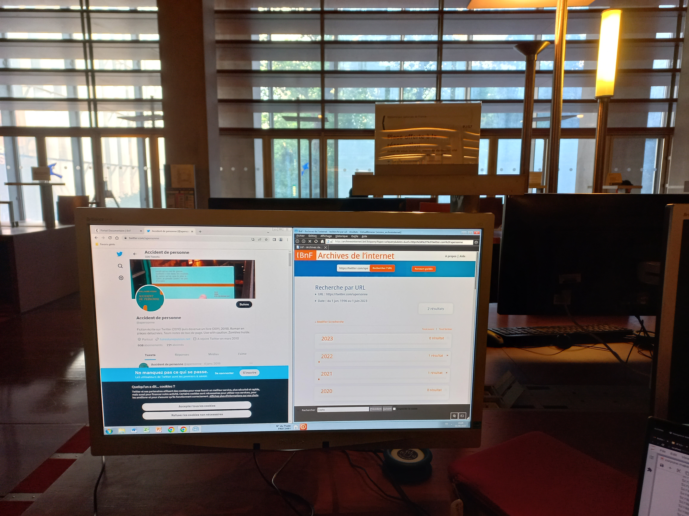

§§§§§§§§§§§§§§§§§§§§§§§§§§§§§§§§§§§§§§§§§§§§§

### *Accident de personne* dans les archives de l'Internet et du Web : une mémoire patrimoniale, mais artificielle

<!-- .element: style="width:500px" -->

===

J'en viens à ma 3e remédiation, 3e lecture.

Pour les chercheurs en littérature et culture numérique, il existe un outil essentiel : les archives de l'Internet et du Web, qui sont collectées systématiquement par la BNF et l'INA depuis 2006, suite à la loi DAVDSI de 2004, pour une mémoire des contenus nativement numérique. 

Il existe à la BN des postes de consultation spécialement conçu pour les archives du web. Ces postes présentent une interface qui rappelle la page d'accueil d'un moteur de recherche courant. Le potentiel de recherche demeure cependant très limité, puisque vous êtes obligé d'entrer directement une url précise pour avoir accès à son archive. En pratique, cela signifie que vous devez avoir deux fenêtres ouvertes sur votre écran : le moteur de recherche courant, connecté à ce qu'on appelle le web "vivant", et le moteur de recherche de l'archive de l'internet où vous collez l'url copiée préalablement -- vous remarquerez que la symétrie sémantique nous encourage à qualifier de manière un peu malheureuse l'archive de l'internet de "web mort"... ce qui finalement n'est pas si éloigné de la vérité, comme on va le constater.

§§§§§§§§§§§§§§§§§§§§§§§§§§§§§§§§§§§§§§§§§§§§§

>l’archive du web n’est pas le web, l’archive d’un site n’est pas le site archivé. La raison essentielle tient à la nature même des contenus et des procédures de collecte : en particulier, la durée de captation étant supérieure au rythme de mise à jour du site, l’archive résultant de la collecte rassemble en fait des parties de site renvoyant à des temps ou époques différents du site : une partie correspondant au site au temps t0, une autre au temps t1 après une mise à jour, etc. Bref, le site archivé n’a jamais existé comme tel dans le Web. 

Bruno Bachimont, "L’archive du web : une nouvelle herméneutique de la trace ?", 2017

===

En effet, une archive du Web, techniquement, n'est pas une archive au sens classique et analogique du terme. Pour bien comprendre le problème de fond, il faut en revenir aux techniques de collecte :

>l’archive du web n’est pas le web, l’archive d’un site n’est pas le site archivé. La raison essentielle tient à la nature même des contenus et des procédures de collecte : en particulier, la durée de captation étant supérieure au rythme de mise à jour du site, l’archive résultant de la collecte rassemble en fait des parties de site renvoyant à des temps ou époques différents du site : une partie correspondant au site au temps t0, une autre au temps t1 après une mise à jour, etc. Bref, le site archivé n’a jamais existé comme tel dans le Web. [Bachimont]

En résumé, l'archive n'est pas une copie conforme de l'original, elle en est une image, souvent lacunaire d'ailleurs, et surtout, elle est une remédiation.

§§§§§§§§§§§§§§§§§§§§§§§§§§§§§§§§§§§§§§§§§§§§§

<!-- .slide: data-background-video="img/BNF-apersonne-figement.mp4" data-background-size="contain" -->

===

Naviguer dans les archives du web, c'est un peu naviguer dans un gruyère. L'archive du web laisse souvent un sentiment de figement, qui procède notamment d'une perte majeure d'interactivité avec les objets collectés -- concrètement, de nombreux liens demeurent non-cliquables, les vidéos ne fonctionnent pas.

La lecture des archives institutionnelles est donc déceptive, en même temps elle est très importante : quand je constate que l'un de mes corpus est archivé à la BNF, j'en nourris un certain sentiment de légitimité de mon travail, qui a su trouver une reconnaissance patrimoniale -- encore à saisir pour les chercheurs que nous sommes. 

§§§§§§§§§§§§§§§§§§§§§§§§§§§§§§§§§§§§§§§§§§§§§

### Architecture de mémoire dans les archives du Web

L'archive n'est pas un medium transparent qui échouerait simplement, par accident, à tout conserver. Ses contraintes techniques propres (moissonnage par URL, reconstitution difficile des pages en WARC, cadre juridique limité du dépôt légal du web) décident activement de ce qui, du projet, devient mémoire patrimoniale et de ce qui disparaît. Mais le véritable message des archives du Web, c'est la légitimation institutionnelle. Son prix, c'est que l'on navigue dans une mémoire artificielle où c'est surtout le péritexte survit, et moins les contenus littéraires eux-mêmes.

===

Ce troisième état révèle peut-être le plus nettement ce que l'intermédialité peut apporter à une réflexion sur l'intertextualité : l'archive n'est pas un medium transparent qui échouerait simplement, par accident, à tout conserver. Ses contraintes techniques propres (moissonnage par URL, reconstitution difficile des pages en WARC, cadre juridique limité du dépôt légal du web) décident activement de ce qui, du projet, devient mémoire patrimoniale et de ce qui disparaît. Ici, le message du medium archive, c'est la légitimation institutionnelle, ce qui n'est pas rien croyez-moi lorsque l'on travaille sur des objets dont la littérarité fait autant débat. Son prix, c'est que l'on navigue dans une mémoire artificielle où c'est surtout le péritexte survit, et moins les contenus littéraires eux-mêmes.
