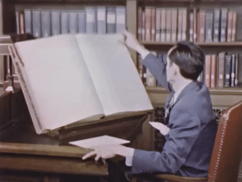
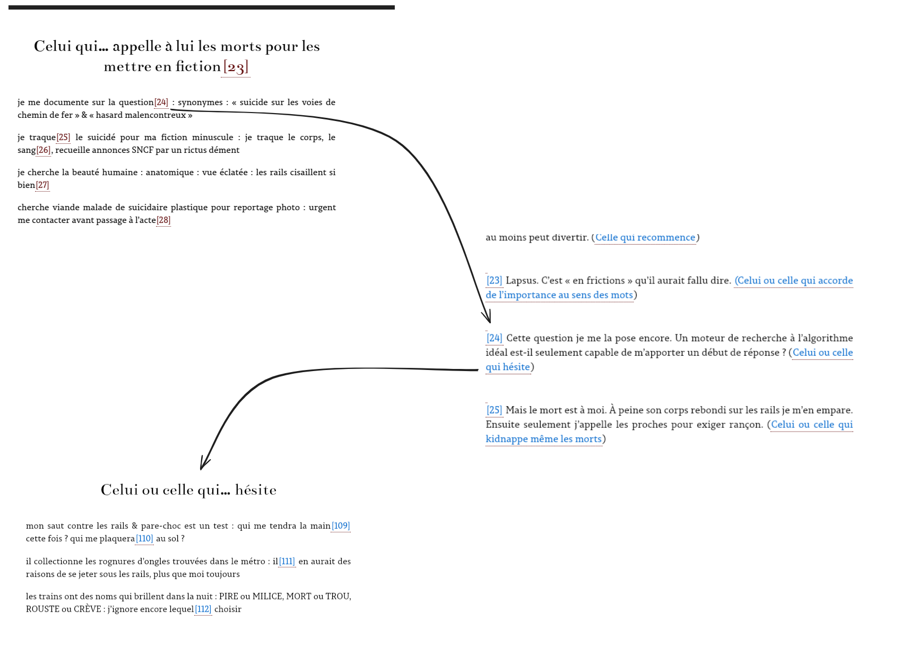
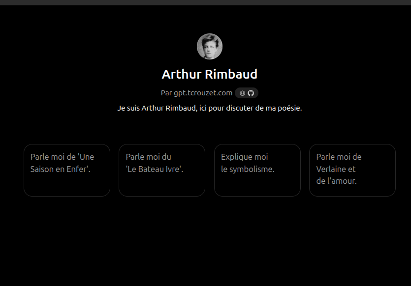
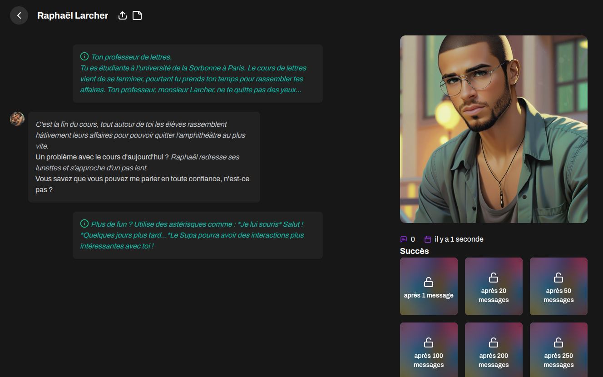
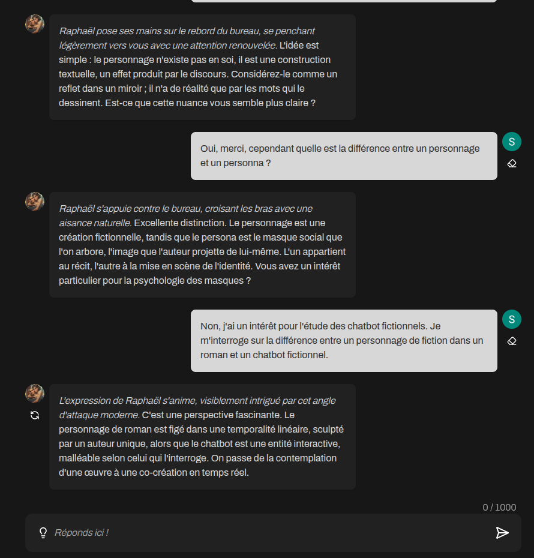
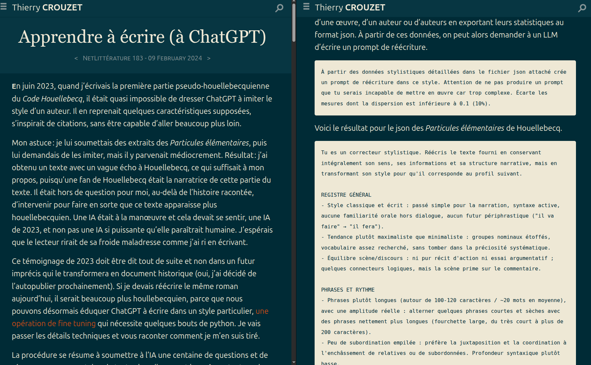
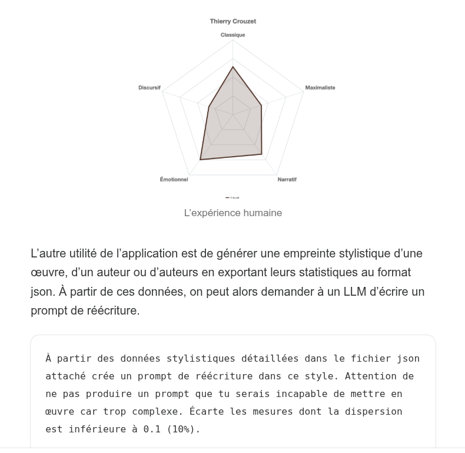

## Toutes sortes de computables

#### Intertextualité(s), intermédialité(s) et humanités numériques

(*work in progress*)

<!-- .element: style="width:500px" -->

===

Travail encore en cours.

Commençons avec une petite anecdote. 

§§§§§§§§§§§§§§§§§§§§§§§§§§§§§§§§§§§§§§§§§§§§§

### Commençons par une petite polémique...

<!-- .element: style="width:50%;float:right;margin-right:-1em;" -->

<!-- .element: style="width:50%;float:left;margin-right:-1em;" -->

===

Polémique de la rentrée littéraire 2024 : À l'occasion de la sortie au Théâtre du Châtelet d'une version remaniée de la Comédie musicale "Les Misérables", écrite et mise en scène par Alain Boulbil et Claude-Michel Schönberg, les éditions Gallimard proposent une réédition en format abrégé du classique de Victor Hugo (415 pages, alors que "l'original" fait tout de même 1300 pages). 

Le public et la presse s'insurgent contre la couverture proposée par Gallimard, qui sous-titre *Les Misérables* "d'après la comédie musicale".

La polémique sera telle que Gallimard revoie sa copie et se contente tout simplement de la mention "version abrégée". 

§§§§§§§§§§§§§§§§§§§§§§§§§§§§§§§§§§§§§§§§§§§§§

Qu'est-ce qui n'allait pas dans cette couverture ?

<!-- .element: style="width:400px" -->

===

Qu'est-ce qui n'allait pas dans cette couverture ? On peut sans doute reprocher à Gallimard une certaine forme d'opportunisme motivé par une stratégie marketting. Mais ce qui a choqué, ici, c'est la transgression d'une conception romantique de l'oeuvre littéraire qui valorise l'originalité ainsi que l'originarité des oeuvres. L'intertextualité, ce ce point de vue, est un concept fort utile qui cherche depuis plus d'un demi-siècle à dépasser cette vision sacralisante de la littérature, en reconnaissant qu'un oeuvre s'inscrit toujours quoiqu'il arrive dans un tissu de références plus ou moins conscientes, plus ou moins assumées par leurs auteurs.

§§§§§§§§§§§§§§§§§§§§§§§§§§§§§§§§§§§§§§§§§§§§§

C'est quoi *Les Misérables* ?

<!-- .element: style="width:700px" -->

===

Cela étant dit, l'intertextualité défend bien souvent une logique relationnelle qui n'échappe pas à une certaine tendance à l'essentialisation : A influence B, puis C, puis D, selon un déroulement chronologique. Pour le dire en deux mot : *Les Misérables*, c'est le texte de Victor Hugo, publié en 1862, 1300 pages. 

Ce roman, par la suite, a fait l'objet de plusieurs rééditions, dont certaines abrégées, mais également d'adaptations, au cinéma, à la TV, ou encore dans les salles de spectacle. 

Qui dit intertextualité dit également traçabilité, comme pour la pièce de boucher que vous avez mangée à midi. 

Si l'on se fie à cette définition, Gallimard fait ici preuve d'une grande malhonnêteté, puisqu'il présente le texte-source de Victor Hugo (l'hypotexte original et historique, la matrice de toute la tradition des *Misérables*) comme s'il dérivait lui-même de son adaptation musicale.

§§§§§§§§§§§§§§§§§§§§§§§§§§§§§§§§§§§§§§§§§§§§§

<!-- .element: style="width:500px" -->

===

Afin d'aller dans le sens de la proposition de ce colloque et de "reconfigurer" l'intertextualité, je vais pourtant tenter de me faire l'avocate du Diable-Gallimard. 

Je dois vous faire un aveu : je suis en train, ici de vous mener en bateau, car je n'ai jamais lu l'édition originale et complète des *Misérables* (1300 pages, quand même, ça décourage), et je vous parle donc d'un livre que je n'ai pas lu -- comme Pierre Bayard nous y encourage dans l'un de ses essais bien connus, qui nous montre bien que la mémoire littéraire est un phénomène qui échappe au texte. 

Ce que je veux défendre, c'est que *Les Misérables*, ce n'est peut-être pas, ou pas seulement comme on le croit souvent, l'oeuvre de Victor Hugo, en tout cas pas le texte de VH, publié en 1862. *Les Misérables*, c'est peut-être d'abord et avant tout l'intertexte des *Misérables*, qui repose lui-même sur une série d'incarnations médiatiques l'ayant tour à tour reconfiguré, augmenté, transformé au fil temps. 

§§§§§§§§§§§§§§§§§§§§§§§§§§§§§§§§§§§§§§§§§§§§§

## Positionnements & (légers) déplacements

* *Mobiliser l'intertextualité pour penser l'actualité de la mémoire littéraire*
* *Étudier des objets encore non-patrimonialisés (non-patrimonialisables) : les avant-gardes littéraires numériques*
* *Démontrer l'intermédialité de l'intextualité*

===

Je profite donc de ma place de dernière conférencière pour me situer de façon un peu oblique par rapport au dyptique intertextualité/HN, en espérant ne pas trop m'inscrire hors du sujet qui nous intéresse. 

Oblique, car ma communication proposera surtout une réflexion sur la notion de mémoire littéraire, en étudiant la pertinence du concept d'intertextualité face à ce que la critique appelle "Le tournant médiatique de la littérature"

Oblique, aussi, car ce colloque a bcp traité, en toute logique, du patrimoine littéraire et de ses effets d'écho et de reprises à travers le temps. Or je vais plutôt délocaliser ma réflexion sur le terrain que je connais le mieux, celui de la création contemporaine "outillée" et de la littérature dite "nativement numérique". Les objets littéraires dont je vais parler ne sont pas encore des objets totalement patrimonialisés, et je dirais même que leur patrimonialisation pose problème pour tout un tas de raisons. 

Oblique, enfin et surtout, car en raison même de la nature des mes corpus je ne me sens pas véritablement compétente pour parler exclusivement d'intertextualité : ma spécialité étant d'abord l'intermédialité -- à savoir l'étude des relations, des emprunts, des échos entre les médias. Au binôme problématique Humanités numériques et Intertextualité, je vais donc me permettre d'ajouter un troisième larron : l'intermédialité.  

§§§§§§§§§§§§§§§§§§§§§§§§§§§§§§§§§§§§§§§§§§§§§

Cas d'étude

<!-- .element: style="width:45%;float:left;margin-right:-1em;" -->

<!-- .element: style="width:45%;float:right;margin-right:-1em;" -->

===

Le premier cas d'étude sur lequel je vais me pencher est celui de la remédiation multiple d'une oeuvre littéraire (accident de personne de Vissac), qui semble être un cas limite, avec lequel je me suis beaucoup débattue pour préparer cette communication. Accident de personne est un cas complexe, à la frontière entre le processus auto-référentiel de type endogénétique comme on a pu le qualifier en génétique des textes, et les phénomène d'auto-intertextualité (Ricardou ou Claude Simon) ou encore d'intertextualité autarcique (Dällenbach), parfois plus simplement appelée auto-textualité. 

Le deuxième axe de réflexion, un peu plus exploratoire, m'ammènera du côté des LLM et du terrain miné des productions littéraires conçues avec des LLM : je m'appuierai sur le cas de l'écrivain Thierry Crouzet. 

§§§§§§§§§§§§§§§§§§§§§§§§§§§§§§§§§§§§§§§§§§§§§

## I. Pour une pensée intermédiale de l'intertextualité 

Quelles architectures de mémoires se logent aux creux de nos outils d'écriture, de lecture et d'analyse des oeuvres littéraires ? 

Que cache l'*inter* de l'intertextualité ?

===

Mon fil directeur, qui m'inscrit dans une perspective propre aux humanités numériques, sera réflexion sur les architectures de mémoires qui se logent aux creux de nos outils d'écriture, de lecture et d'analyse des oeuvres littéraires. Si l'intertextualité est souvent mobilisée pour interroger le concept même de texte, je voudrais m'occuper du sens même de l'"inter", de ce qui se place entre les textes et les lecteurs, entre les textes eux-mêmes : leur matérialité et leur condition médiatique d'existence. 

Comme le problématisait l'appel de ce colloque, l'intertextualité est un "objet théorique" mouvant, qui oscille entre une définition "stricte" (soit la relation directe entre un hypotexte et son dérivé), et une définition inclusive, qui recoupe les allusions, les références implicites, les cadres génériques, culturels ou linguistiques.

De ce point de vue, et ce colloque l'a démontré, les HN ont choisi leur camp, en permettant d'ouvrir la liste des critères de l'intertextualité et en facilitant leur repérage.

§§§§§§§§§§§§§§§§§§§§§§§§§§§§§§§§§§§§§§§§§§§§§

### Le paradoxe de l'intertextualité

En inscrivant l'oeuvre dans un réseau de textualités, l'intertextualité, même quand elle est comprise de manière inclusive, a tendance à focaliser l'attention des chercheurs et des lecteurs sur le texte.

===

Il me semble pourtant que le concept d'intertextualité porte en lui, quoiqu'il arrive, un paradoxe. Il nous pousse en effet, et fort heureusement, à désessentialiser le texte qui compose toute oeuvre littéraire, en insistant sur le rôle joué par la mémoire littéraire. 

Cette mémoire peut être à la fois collective et personnelle, consciente ou inconsciente, comme l'a montré Kristeva. Elle vient toucher concrètement à une expérience singulière de lecture, mais aussi une expérience de non-lecture (je n'ai pas lu l'Intégralité des *Misérables*, mais cette oeuvre occupe une place majeure dans ma mémoire littéraire car j'en ai entendu parler, j'en ai lu des version abrégées, des extraits et vu des adaptations). Cette mémoire exerce quoiqu'il arrive une influence sur notre écriture, mais également sur notre lecture et notre compréhension des oeuvres en général. 

Mais en inscrivant l'oeuvre dans un réseau de textualités, l'intertextualité, même quand elle est comprise de manière "inclusive", a tendance à focaliser l'attention des chercheurs et des lecteurs sur le texte. Le texte demeure le comparable pour mesurer un phénomène de mémoire littéraire dont on entrevoit la complexité, mais qui manque certainement de prise pour être appréhendé dans son ensemble. 

§§§§§§§§§§§§§§§§§§§§§§§§§§§§§§§§§§§§§§§§§§§§§

## Où se loge la mémoire littéraire&nbsp;? 

* Dans l'oeuvre - conçue comme une entité virtuelle qui n'existe dans aucun état matériel particulier ? 
* Dans les corpus, c'est-à-dire déjà dans les réseaux de textes que nous construisons de manière toujours plus ou moins biaisée ? 
* Dans les outils que nous utilisons pour déterminer et analyser les relations intertextuelles ?

===

C'est ce paradoxe que je souhaite adresser aujourd'hui : si l'intertextualité désessentialise le texte, mais que la mesure de la mémoire littéraire a besoin du texte comme unité stable, alors où se loge alors cette mémoire ? 

Dans l'oeuvre -- espèce d'entité virtuelle qui n'existerait dans aucun état matériel particulier, mais pour lequel on peut identifier, parfois rétrospectivement et génétiquement, une série d'états ayant conduit à une publication ? 

Dans les corpus, c'est-à-dire déjà dans les réseaux de textes que nous construisons de manière toujours plus ou moins biaisée ? 

Ou même, et c'est là je crois le point d'attention que l'on doit avoir lorsque l'on pratique les Humanités numériques, dans les outils que nous utilisons pour déterminer et analyser les relations intertextuelles ? 

La réponse se situe certainement à chacun de ces trois niveaux, tous travaillés à leur manière par leur matérialité. C'est à l'étude de cette matérialité que l'intermédialité peut apporter une contribution spécifique à l'intertextualité et aux HN. 

§§§§§§§§§§§§§§§§§§§§§§§§§§§§§§§§§§§§§§§§§§§§§

### De *Toutes sortes de misérables*... 

<!-- .element: style="width:40%;float:right;margin-right:-1em;" -->

>[Un] classique se définit moins par sa permanence que par sa mutabilité. L'oeuvre dure parce qu'elle s'adapte aux changements d'époque et non parce que son autorité lui vient de sa matière même, inaltérable. [La] définition même de la littérature est engagée dans ce débat : si, comme je le souhaite, on refuse d'en faire seulement un patrimoine, soit une monumentalité immuable et sacrée, mais qu'on choisisse de la voir comme quelque chose de vivant, comme un ensemble de variations, internes et externes, alors les récritures et les adaptations ne l'altèrent pas toujours, mais la font exister.

<!-- .element: style="width:50%;float:left;margin-left:-1em; font-size:1.4rem; text-align:justify" -->

===

Début 2026, Typhaine Samoyault, elle-même spécialiste de l'intertextualité, a publié l'ouvrage *Toutes sortes de Misérables* dont on a beaucoup parlé dans le champ des études littéraires. L'un des objectifs annoncés de cet essai consiste à répondre à la question devenue aujourd'hui éminement politique "Faut-il réécrire les classiques ?" Il s'agit, en creux, de proposer des arguments pour répondre aux accusations de censure imputées à ce qu'il est coutume d'appeler aujourd'hui la _cancel culture_ soi-disant prompte à réécrire les oeuvres du passé pour les adapter à notre culture contemporaine. 

Typhaine Samoyault, qui s'appuie comme vous l'aurez compris sur l'exemple des *Misérables*, revient sur la polémique de 2024. Si elle regrette elle aussi l'opportunisme de Gallimard, elle rejette cependant la tentation d'essentialisation du "classique" littéraire, pour aller jusqu'à proposer une conception de l'instabilité comme condition du canon :

>"un classique se définit moins par sa permanence que par sa mutabilité. L'oeuvre dure parce qu'elle s'adapte aux changements d'époque et non parce que son autorité lui vient de sa matière même, inaltérable." 

>"la définition même de la littérature est engagée dans ce débat : si, comme je le souhaite, on refuse d'en faire seulement un patrimoine, soit une monumentalité immuable et sacrée, mais qu'on choisisse de la voir comme quelque chose de vivant, comme un ensemble de variations, internes et externes, alors les récritures et les adaptations ne l'altèrent pas toujours, mais la font exister."

En d'autres termes, le texte n'existe pas, mais la mémoire des textes existe. Et plus un livre est transformé, réécrit, adapté, abrégé, traduit... c'est-à-dire plus il multiplie les effets d'auto-textualité, plus il devient mémorable.

Pour porter cette conception de la littérature, Typhaine Samoyault met en place une méthode, qui consiste à nous présenter ses différences lectures des *Misérables* de Hugo : son chapitre "Trois fois *Les Misérables*" revient sur la lecture d'une édition abrégée pour enfant (Lecture et loisir), la lecture d'une édition complète en trois volumes chez Folio, et enfin une lecture d'une édition Pléiade. 

Faire l'expérience du canon littéraire, c'est pouvoir démultiplier les lectures d'une oeuvre. Typhaine Samoyault insiste beaucoup sur cette démultiplication, qui relève de la vie éditoriale du texteé

Je voudrais à la fois reprendre à mon compte les propos de Typhaine Samoyault tout en ouvrant davantage encore son propos : ce qui se joue dans ces multiples _versions_ du texte, c'est également une expérience médiatique différente. Ainsi faut-il, à mon sens, concevoir l'intertextualité à la lumière d'une herméneutique matérielle que permet l'intermédialité.

§§§§§§§§§§§§§§§§§§§§§§§§§§§§§§§§§§§§§§§§§§§§§

### ...à toutes sortes de computables

Chaque remédiation dans un dispositif computationnel distinct -- qui vaut pour architecture de mémoire -- transforme mémoire de l'oeuvre et, avec elle, la notion même de mémoire littéraire.

===

Sur le modèle entrouvert par Typhaine Samoyault, je vais vous proposer une méthode qui retrace une histoire de mes différentes expériences de lectures, en insistant sur l'influence des dispositifs matériels utilisés pour créer, diffuser mais également lire les oeuvres numériques. 

En référence intertextuelle à "toutes sortes de Misérables", je proposerai donc l'expression "toutes sortes de computables", qui m'inscrit également dans la tradition intermédiale McLuhanienne, celle de l'attention portée au média et à son "message".

Toutes sortes de computables, donc, pour comprendre comment les opérations de remédiation nécessaires à la diffusion des textes numériques, génèrent des effets d'intertextualité, avec ces effets travaillent la notion de mémoire littéraire. Mon hypothèse est que chaque remédiation opérée par un dispositif computationnel (y compris ceux qui nous permettent de transformer nos corpus en données mesurables et iterprétables) propose une nouvelle architecture de mémoires, laquelle transforme la mémoire des oeuvres, et avec elle la notion même de mémoire littéraire.

Ça c'était pour la partie théorique, qui se tient pas trop mal je l'espère, malgré quelques éléments un peu bancals on s'en sort à peu près. Je vais maintenant confronter ces belles paroles à mon terrain, et vous allez voir que ça se complique, parce que j'ai choisi des cas qui sont des cas limites, que j'étudie pour le premier depuis une dizaine d'années, mais qui me donne encore du fil à retordre. 

§§§§§§§§§§§§§§§§§§§§§§§§§§§§§§§§§§§§§§§§§§§§§

### II. Une intertextualité stratigraphique : le cas limite du projet littéraire "Accident de Personne" (Guillaume Vissac)

<!-- .element: style="width:500px" -->

===

Mon premier exemple s'intitule _Accident de personne_ : il s'agit d'un projet littéraire mené par l'écrivain français Guillaume Vissac. Je l'ai lu pas moins de cinq fois, sous cinq formes différentes. 

Dans le cadre de mes travaux sur la littérature numérique, cela fait quelques années que j'ai lâché le concept d'oeuvre, pour le remplacer par celui de projet littéraire : un projet littéraire numérique se déploie sur le temps long, parfois des années. Chez Vissac, on compte près de 8 ans.

Il comprend différent "moments" du texte et de sa production, dont certains peuvent être collaboratifs, puis individuels, puis de nouveaux collectifs. Certains "moments" font l'objet d'une cristallisation, soit de stabilisation du texte, dans des versions, des formes et des formats spécifiques, qui engagent à la fois des mutations du texte, mais également des mutations du dispositif de lecture. 

Cette notion de projet qui force le concept d'intertextualité à sortir de son présupposé mono-médial, dessine en creux un modèle de mémoire qui n'est plus seulement relationnelle, mais stratigraphique. La particularité du projet littéraire est donc qu'il porte en lui sa propre mémoire. Comme je veux le démontrer, chacune des cinq lectures qui suivent n'est donc pas seulement un nouvel état du texte, mais l'occasion de se demander ce que son medium propre fait à la mémoire du projet -- ce qu'il retient, ce qu'il réorganise, ce qu'il laisse irrémédiablement filer.

§§§§§§§§§§§§§§§§§§§§§§§§§§§§§§§§§§§§§§§§§§§§§

### @Apersonne sur Twitter : mémoire d'une performance littéraire

<!-- .element: style="width:400px" -->

===

À l'origine, *Accident de personne* est une expérience Twittéraire : une littérature écriture et publiée sur Twitter, pour Twitter, cad en 180 caractères. C'est une forme de littérature à contrainte. 

Il se présente sous la forme d'un profil intitulé "Accident de personne", publié sous l'identité profilaire \@apersonne. Le titre du profil renvoie à cet euphémisme employé par la RATP pour annoncer les suicides sur le réseau. Je peux voir que le compte a été essentiellement actif entre Novembre 2010 et Janvier 2011. À cette une époque, Twitter est encore Twitter, c'est-à-dire un réseau social cool, où vont se structurer plusieurs communautés d'écriture : des artistes, des écrivains, des journalistes, des chercheurs. 

§§§§§§§§§§§§§§§§§§§§§§§§§§§§§§§§§§§§§§§§§§§§§

<!-- .element: style="width:400px" -->

===

les textes-tweets sont toujours très courts, généralement une phrase ou comme un morceau de phrase interrompu, voire pioché à la volée, puisqu'il n'y a ni majuscule ni point : 

>assis entre les rails, longue ligne droite, bras autour des genoux, j'attends d'être cueilli (28 décembre)

>moi aussi je suis peut-être colis piégé : j'attends sur le bord de moi-même mon moment pour bondir (20 décembre)

>ma peur c'est pas que le train arrive trop vite mais trop lent : laisserait dans son sillage des bouts de moi suffocants mais ratés (17 novembre)

Un premier constat : c'est que le genre tweetéraire s'inscrit dans un intertexte générique : *Accident de personne* n'est pas sans rappeler l'élégie, puisque la parole est déléguée la plupart du temps aux suicidaires et suicidés, parfois aux autres voyageurs, et à toutes celles et ceux qui interviennent sur ce type d'accident (régulateurs de flux, policiers, etc.). Le ton est celui de la plainte, on y retrouve l'expression de la tristesse, et en même temps l'auteur y introduit des effets d'ironie. 

§§§§§§§§§§§§§§§§§§§§§§§§§§§§§§§§§§§§§§§§§§§§§

### Sauf qu'en vérité...

...Je n'ai pas (vraiment) lu _Accident de personne_ sur le profil @apersonne

<!-- .element: style="width:350px" -->

===

Avant d'aller plus loin, il me faut vous faire un aveu : je n'ai **pas** lu les publications du profil en temps réel, pour la bonne raison que je n'avais encore de profil Twitter à cette époque, en 2010. 

Je ne me rappelle plus très bien du moment où je lis pour la première fois *Accident de personne*, mais c'est sans doute déjà en 2014, et pour tout vous dire je vais la découvrir non pas sur Twitter, mais dans une republication en version epub. Je vais parler dans un instant de cette première remédiation et de ce qu'elle implique pour la lectrice que je suis, mais j'en reviens à ce profil. 

§§§§§§§§§§§§§§§§§§§§§§§§§§§§§§§§§§§§§§§§§§§§§

<!-- .element: style="width:400px" -->

===

Lorsque je consulte pour la première fois le profil Twitter d'@apersonne, c'est donc bien après la bataille, et je trouve en fait déjà un profil éditorialisé, ainsi qu'un projet littéraire terminé.

Ma lecture n'est pas très confortable : comme vous en avez déjà fait l'expérience ici ou ailleurs, je ne peux lire le texte qu'en ordre anté-chronologique. Je commence par la fin, je remontre en scrollant vers le "début". Je m'aperçois rapidement que les tweets étaient publiés à heure fixe : 7h, 9h, 12h, 18h et 20h, ce qui laisse supposer un caractère feuilletonnesque assez inédit sur le réseau. Je vois également des traces d'éditorialisation propre aux RSN, avec des retweets, des citations, des mentions à d'autres profils du réseau, des hashtag, ainsi que des liens externes, souvent vers YouTube. 

Ma lecture, ici, n'est pas tant celle d'une oeuvre que celle des traces d'une oeuvre littéraire en ligne, conçue pour être au coeur d'une performance d'écriture, mais également d'une performance algorithmique et profilaire. Lire aujourd'hui le profil \@personne c'est faire une double expérience un peu contradictoire. Celle, d'abord, de cette forme très spécifique d'écriture qu'est le micro-blogging avec ses effet d'instantanéité, de réseau, de flux. Mais c'est aussi déjà faire l'expérience de la dimension très conjoncturelle et transitoire de ce qui se passe sur les réseaux : certains liens sont morts ; des profils cités ont disparu. Je peux encore lire à l'envers les publication du profil, mais son intéractivité n'est plus d'actualité : quel sens y aurait-il ici à retweeter une phrase ? À répondre à un commentaire ? Sans doute aucun. La performance est terminée.

§§§§§§§§§§§§§§§§§§§§§§§§§§§§§§§§§§§§§§§§§§§§§

### Architecture de mémoire sur Twitter

Le medium Twitter ne se contente pas de porter le texte : son message, au sens de McLuhan, c'est l'instantanéité collective, la lecture calée sur un rythme partagé, celui des heures de pointe. La mémoire que ce premier état du projet construit n'est donc pas seulement celle des fragments eux-mêmes, mais celle d'une performance synchronisée : une mémoire qui, par nature, ne survit pas à son medium. Ce que je lis aujourd'hui n'est plus cette mémoire-là, mais sa trace fossilisée, déjà vidée de ce qui en faisait le message propre.

===

Le medium Twitter, ici, ne se contente pas de porter le texte : son message, au sens de McLuhan, c'est l'instantanéité collective, la lecture calée sur un rythme partagé, celui des heures de pointe. La mémoire que ce premier état du projet construit n'est donc pas seulement celle des fragments eux-mêmes, mais celle d'une performance synchronisée : une mémoire qui, par nature, ne survit pas à son medium. Ce que je lis aujourd'hui n'est plus cette mémoire-là, mais sa trace fossilisée, déjà vidée de ce qui en faisait le message propre.

§§§§§§§§§§§§§§§§§§§§§§§§§§§§§§§§§§§§§§§§§§§§§

### *Accident de personne* en epub chez publie.net : une mémoire anthologique 

<!-- .element: style="width:300px" -->

===

La vraie première fois que j'ai lu *Accident de personne*, c'est dans sa version epub de publie.net, une version que m'a donnée Marcello Vitali-Rosati qui l'avait achetée, et qui n'était pas soumise à des DRM. Cette republication engage de fait une remédiatisation de l'oeuvre, qui va aboutir à trois effets très importants : 

* L'ajout d'une préface qui explique le projet
* Une curation des tweets réorganisés par thématiques et surtout par personnages
* Une navigation hypertextuelle permise par le format epub

§§§§§§§§§§§§§§§§§§§§§§§§§§§§§§§§§§§§§§§§§§§§§

>Pendant presque deux ans, je passais entre deux et trois heures par jour en transport en commun (RER, métros). Tout ce temps-là, mis bout à bout, ça fout la lourde comme on dit par chez moi, le vertige. J’ai donc eu mon compte d’accidents de personne, je ne les ai pas comptés, mais toujours une atmosphère particulière dans le wagon lorsque le conducteur l’annonce, ou sur les quais quand les écrans clignotent. Un jour l’un d’entre eux m’a fait arriver deux heures en retard dans mon boulot de l’époque. Ce jour-là, l’idée d’en faire quelque chose, de prendre des notes, et l’écriture de la toute première.

Guillaume Vissac, *Accident de personne*, version epub, 2011, préface

<!-- .element: style="font-size:1.5rem; text-align:right" -->

===

Je me permets de citer un peu longuement la préface, qui explicite la genèse du projet et le rend en vérité bien plus clair que sur la plateforme Twitter elle-même : 

>Pendant presque deux ans, je passais entre deux et trois heures par jour en transport en commun (RER, métros). Tout ce temps-là, mis bout à bout, ça fout la lourde comme on dit par chez moi, le vertige. J’ai donc eu mon compte d’accidents de personne, je ne les ai pas comptés, mais toujours une atmosphère particulière dans le wagon lorsque le conducteur l’annonce, ou sur les quais quand les écrans clignotent. Un jour l’un d’entre eux m’a fait arriver deux heures en retard dans mon boulot de l’époque. Ce jour-là, l’idée d’en faire quelque chose, de prendre des notes, et l’écriture de la toute première.

§§§§§§§§§§§§§§§§§§§§§§§§§§§§§§§§§§§§§§§§§§§§§

>La prise de notes a duré un an et demi. Toutes ces notes (ou la plupart) ont été écrites directement embarqué soit dans les wagons, soit sur les quais, au téléphone portable classique, ensuite via l’iPhone. [\...] Fin 2010, j’avais plus de 200 fragments d’écrits, tous de moins de 140 caractères, alors j’ai créé le compte @apersonne, j’ai épuré mon texte. J’en ai gardé environ 160. De cette façon, j’ai pu mettre en ligne 5 fragments par jour pendant un mois tout juste.

Guillaume Vissac, *Accident de personne*, version epub, 2011, préface

<!-- .element: style="font-size:1.5rem; text-align:right" -->

===

>La prise de notes a duré un an et demi. Toutes ces notes (ou la plupart) ont été écrites directement embarqué soit dans les wagons, soit sur les quais, au téléphone portable classique, ensuite via l’iPhone. [\...] Fin 2010, j’avais plus de 200 fragments d’écrits, tous de moins de 140 caractères, alors j’ai créé le compte @apersonne, j’ai épuré mon texte. J’en ai gardé environ 160. De cette façon, j’ai pu mettre en ligne 5 fragments par jour pendant un mois tout juste. 

§§§§§§§§§§§§§§§§§§§§§§§§§§§§§§§§§§§§§§§§§§§§§

>Passé fin décembre, j’ai mis au propre, rassemblé le tout dans un abécédaire. A l’origine il n’était pas prévu que des figures émergent, et puis des personnages sont apparus d’eux mêmes, par exemple celui qui cherche une chanson idéale pour la passer au moment de mourir, celle qui se tue mais plusieurs fois, car ça marche pas, les régulateurs de flux que je voyais tous les jours deux fois par jour, etc. Alors les classer par personnages, c’était une idée. Les notes de bas de page, c’est venu pendant cette phase là, histoire de faire dialoguer tout le monde, du coup toutes les notes sont inédites, jamais apparues sur twitter, plus de 140 caractères pour certaines.

Guillaume Vissac, *Accident de personne*, version epub, 2011, préface

<!-- .element: style="font-size:1.5rem; text-align:right" -->

===

Guillaume Vissac poursuit : 

>Passé fin décembre, j’ai mis au propre, rassemblé le tout dans un abécédaire. A l’origine il n’était pas prévu que des figures émergent, et puis des personnages sont apparus d’eux mêmes, par exemple celui qui cherche une chanson idéale pour la passer au moment de mourir, celle qui se tue mais plusieurs fois, car ça marche pas, les régulateurs de flux que je voyais tous les jours deux fois par jour, etc. Alors les classer par personnages, c’était une idée. Les notes de bas de page, c’est venu pendant cette phase là, histoire de faire dialoguer tout le monde, du coup toutes les notes sont inédites, jamais apparues sur twitter, plus de 140 caractères pour certaines.

§§§§§§§§§§§§§§§§§§§§§§§§§§§§§§§§§§§§§§§§§§§§§
<!-- .slide: data-background-video="img/accidentDePersonneEpub.webm" data-background-size="contain" -->

===

Cette curation des contenus pour leur remédiation sous forme d'epub, permet comme le dit Vissac la création de personnages, qui vont permettre une structuration en chapitre de l'ouvrage, avec des titres à mi-chemin entre l'hagiographie antique et les épisodes de friends : "Celui qui… a du mal à assumer", "Celui qui… a le sens de la formule", "Celui qui… a le sens de la mise en scène", "Celui qui… travaille plus pour gagner plus".

J'insiste sur ce qu'en dit Vissac: "des personnages sont apparus d’eux mêmes", grâce à cette réorganisation anthologique qui a permis de les faire émerger.

Un exemple : 

>Celui qui… appelle à lui les morts pour les mettre en fiction[23] 
>je me documente sur la question[24]  : synonymes : « suicide sur les voies de chemin de fer » & « hasard
malencontreux » 
>je traque[25] le suicidé pour ma fiction minuscule : je traque le corps, le sang[26], recueille annonces SNCF par un
rictus dément 
>je cherche la beauté humaine : anatomique : vue éclatée : les rails cisaillent si bien[27] 
cherche viande malade de suicidaire plastique pour reportage photo : urgent me contacter avant passage à l’acte[28] 

§§§§§§§§§§§§§§§§§§§§§§§§§§§§§§§§§§§§§§§§§§§§§

===

Cette linéarité est cependant détournée en partie par un système de notes et de renvois cliquables, qui viennent ajouter une structure narrative plus complexe, avec des effets d'échos, d'ironie, de détournement. Par exemple, pour la note 24 de "je me documente sur la question" :

>[24] Cette question je me la pose encore. Un moteur de recherche à l’algorithme idéal est-il seulement capable de
m’apporter un début de réponse ? (Celui ou celle qui hésite).

Et la note termine par un renvoi à un autre chapitre, proposant ainsi un parcours de lecture qui rompt avec la linéarité traditionnelle du livre. L'expérience de lecture, ici, est donc une expérience hypertuelle, qui joue sur les potentialités du format epub, format souvent décrié pour son côté homothétique, mais qui démontre ici une capacité à rendre plus lisibles les écritures profilaires, en dehors de leur interface d'origine.

§§§§§§§§§§§§§§§§§§§§§§§§§§§§§§§§§§§§§§§§§§§§§

Ce que le format epub vient ajouter, ce n'est pas un supplément neutre de lisibilité : c'est une nouvelle architecture de la mémoire du projet. Là où le flux Twitter organisait la mémoire selon un axe strictement temporel, l'epub la réorganise selon un axe associatif, avec la création de personnages qui "émergent" de la matière et de la forme anthologique du livre. Le medium ne conserve pas la mémoire du projet, il en propose une seconde version, structurée cette fois par la logique du noeud et du renvoi plutôt que par celle du fil.

===

Ce que le format epub vient ajouter, ce n'est pas un supplément neutre de lisibilité : c'est une nouvelle architecture de la mémoire du projet. Là où le flux Twitter organisait la mémoire selon un axe strictement temporel, l'epub la réorganise selon un axe associatif, avec la création de personnages, les notes et les renvois. Le medium ne conserve pas la mémoire du projet, il en propose une seconde version, structurée cette fois par la logique du noeud et du renvoi plutôt que par celle du fil.

§§§§§§§§§§§§§§§§§§§§§§§§§§§§§§§§§§§§§§§§§§§§§

### *Accident de personne* dans mon jupyter notebook : la mémoire d'une question de recherche et de sa méthode

<!-- .element: style="width:600px" -->

===

Je ne me suis pas toujours contentée de lire les versions publiées par Vissac, je suis allée moi-même recomposer Accident de personne en moissonnant le profil avant que twitter ne ferme ses accès API aux chercheurs. 

Cette approche outillée m'a amenée à relire l'oeuvre autrement, à travers les potentialités des *endpoints* de l'API et les contraintes de sécurité d'une plateforme en voie d'emmerdification.

§§§§§§§§§§§§§§§§§§§§§§§§§§§§§§§§§§§§§§§§§§§§§

<!-- .element: style="width:800px" -->

===

Le moissonnage semi-automatique d'un profil numérique, réalisé à l'aide d'un notebook Jupyter avec la librairie Minet de SciencesPo, est une opération qui relève pleinement de l'herméneutique des données, tel que Stéfan Sinclair ou Geoffrey Rockwell ont pu la décrire dans leur ouvrage *Hermeneutica*. 

On touche ici complètement une méthode en humanités numériques, en considérant la textualité des objets numériques comme un ensemble de données, ou plus précisément de capta, et donc essayer de récupérer, d'organiser et d'analyser les écritures invisibles qui se cachent sous les interfaces numériques. 

§§§§§§§§§§§§§§§§§§§§§§§§§§§§§§§§§§§§§§§§§§§§§

<!-- .element: style="width:800px" -->

===

Cette lecture distante illustre que l'outil n'est jamais un instrument neutre d'analyse intertextuelle, il est lui-même une architecture de mémoire. 

Par exemple, j'ai décidé que le corpus pertinent ne se limitait plus au seul profil mais devait inclure les comptes qui l'ont mentionné. Ce n'est pas moi toute seule qui redéfinis le périmètre du corpus, c'est également la logique computationnelle de l'outil, sa capacité à interroger le réseau plutôt que le seul fil, qui impose une nouvelle délimitation de ce qui compte comme mémoire du projet -- mémoire d'un collectif actif au même moment sur un réseau social.

§§§§§§§§§§§§§§§§§§§§§§§§§§§§§§§§§§§§§§§§§§§§§

### Architecture de mémoire de mon notebook & de mes captas

Ce nouvel intertexte, porte la trace d'une question de recherche toute personnelle : mon biais pour l'utopie du collectif que j'ai souvent cherché à identifier dans les oeuvres de littérature numérique. Plus que la remédiation du corpus que j'opère, c'est bien ma méthode, et ses postulats théoriques, qui sont habités par une certaine conceptions située de la mémoire. 

===

Ce nouveau corpus, ce nouvel intertexte, porte également la trace d'une question de recherche toute personnelle : mon biais pour l'utopie du collectif que j'ai souvent cherché à identifier dans les oeuvres de littérature numérique. Plus que la remédiation du corpus que j'opère, c'est bien ma méthode, et ses postulats théoriques, qui sont habités par une certaine conceptions située de la mémoire. 

§§§§§§§§§§§§§§§§§§§§§§§§§§§§§§§§§§§§§§§§§§§§§

### *Accident de personne* en livre imprimé : la "dernière strate", mémoire historique du projet, mémorialisation de l'auteur

<!-- .element: style="width:45%;float:right;margin-right:-1em;" -->

>La dernière strate est ici, maintenant, et prend la forme d'un livre papier. S'il fallait le définir, sans doute faudrait-il écrire ici qu'il s'agit d'un roman en pièces détachées. [...] Peut-être *Accident de personne*, durant ces quelques années d'écriture, désécriture, réécriture, a-t-il su cristalliser quelques bribes, quelques bris [des vies souterraines de nos villes]. 

<!-- .element: style="width:50%;float:left;margin-left:-1em; font-size:1.3rem; text-align:justify" -->

Guillaume Vissac, préface d'*Accident de personne*, version imprimée, Nouvel Attila, "Othello", 2018, p.7.

<!-- .element: style="width:45%;float:left;margin-left:-1em; font-size:1.2rem; text-align:justify" -->

===

>La dernière strate est ici, maintenant, et prend la forme d'un livre papier. S'il fallait le définir, sans doute faudrait-il écrire ici qu'il s'agit d'un roman en pièces détachées. [...] Peut-être *Accident de personne*, durant ces quelques années d'écriture, désécriture, réécriture, a-t-il su cristalliser quelques bribes, quelques bris [des vies souterraines de nos villes]. 

§§§§§§§§§§§§§§§§§§§§§§§§§§§§§§§§§§§§§§§§§§§§§

<!-- .element: style="width:50%;float:right;margin-right:-1em;" -->

<!-- .element: style="width:50%;float:left;margin-right:-1em;" -->

===

La dernière remédiation d'Accident de personne paraît en 2018, sous la forme la plus institutionnelle qui soit et peut-être la plus inattendue pour un projet nativement numérique : un livre imprimé, publié au Nouvel Attila par Benoît Virot. 

Le passage à l'imprimé nous oblige à questionner la "computabilité" qui semble ici totalement disparaître. Elle pose également une question vertigineuse : l'imprimé sonne-t-il la canonisation du numérique par l'effacement total de la dimension informatique, et ainsi d'une certaine mémoire de la fabrique du projet ? 

De mon point de vue, le message de ce cinquième medium est décissif. D'une part, la forme matérielle du livre, sa table des matières, son jeu de renvois, le design graphique de sa couverture et son format qui constitue une référence visuelle au ticket de métro : tout cela n'est pas une simple neutralisation de l'origine numérique du projet, ç'en est une traduction dans une matérialité différente, celle de l'objet livre conçu comme livre d'artiste. 

§§§§§§§§§§§§§§§§§§§§§§§§§§§§§§§§§§§§§§§§§§§§§

### L'architecture de mémoire du livre : la légitimation littéraire

Le livre en tant que forme "symbolique" amène à opérer un changement de perspective, qui nous fait considérer un objet temporairement twittéraire non plus seulement comme un objet performatif et heuristique (ainsi que le propose Bouchardon à propos de la valeur de la littérature numérique), mais comme un objet historique, témoignage d'un moment du texte autant que d'un contexte culturel et médiatique : celui de l'âge d'or du Web, qui n'aura décidément pas "tué le livre", ni son pouvoir de légitimation.

===

D'autre part, le livre en tant que forme "symbolique" amène à opérer un changement de perspective, qui nous fait considérer un objet temporairement twittéraire non plus seulement comme un objet performatif et heuristique (ainsi que le propose Bouchardon à propos de la valeur de la littérature numérique), mais comme un objet historique, témoignage d'un moment du texte autant que d'un contexte culturel et médiatique : celui de l'âge d'or du Web.

Cette dernière remédiation m'amène enfin à relativiser ce que je défends depuis tout à l'heure, car si le média participe d'une désessentialisation des textes, lui-même n'échappe pas à des logiques essentialistes ou, du moins, à des effets de hiérarchie. Mes nombreux entretiens avec les créateurs qui mobilisent la logique du chantier littéraire sur le Web m'encouragent à l'affirmer : la publication chez un éditeur reste l'objectif de la plupart des écrivains. Pourquoi ? Parce que c'est encore lui qui, aujourd'hui, permet à l'écrivain de devenir auteur, et d'espérer entrer ainsi dans la mémoire littéraire.

§§§§§§§§§§§§§§§§§§§§§§§§§§§§§§§§§§§§§§§§§§§§§

### III. Une intertextualité "latente"

### Vers toutes sortes de "mémorables" ?

<!-- .element: style="width:600px" -->

===

Je vous emmène à présent en terrain miné : celui de la création contemporaine qui mobilise les LLM. Terrain miné, car il génère des débats entre les artistes-auteurs eux-mêmes, mais aussi entre les auteurs et leurs lecteurs. Dans le champ de la création assistée par IA, l'intertextualité surgit souvent comme un argument de légitimation : en effet, le LLM serait finalement une façon parmi d'autres de mobiliser la mémoire littéraire et de s'inscrire dans un réseau de référence. 

Cet argument ne fait pas consensus. 

Courageusement, je tâcherai de ne pas trop rentrer dans le débat, ou de le décaler, en m'intéressant à la façon dont le LLM, en tant qu'outil de création littéraire, propose un nouveau paradigme de la mémoire littéraire que plusieurs écrivains ont choisi de prendre à bras le corps et de questionner, de manière à la fois critique et créative.

§§§§§§§§§§§§§§§§§§§§§§§§§§§§§§§§§§§§§§§§§§§§§

### Comment le LLM règle la question de la mémoire littéraire

La mémoire est "compressée", réduite à une série de chiffres (un vecteur) qui spatialise tous les énoncés et les positionnent les uns par rapport aux autres : l'"espace culturel" est modélisé et devient latent. Il n'y a plus qu'à l'opérer. L'outil, en d'autres termes, devient lui-même un lieu de mémoire, distinct du corpus qu'il a ingéré, ce qui ajoute une médiation supplémentaire.

Que fait-on entrer dans la mémoire calculable de la littérature ? Question subsidiaire : qui décide de ce qui entre dans la mémoire calculable de la littérature ?

===

Quelques généralités tout d'abord. Fondamentalement, le LLM renvoie à conception inclusive et large de l'intertextualité : il ne "cite" pas un hypotexte, mais il reconstitue un corpus d'entraînement dont la mémoire est à la fois massive, opaque et sélective. 

Dans le même temps, le LLM nous fait rebasculer dans une approche radicalement textualiste, puisque les données d'entraînement réduisent le corpus à de la donnée purement textuelle. En dépit de leur caractère *massifs* les LLM connaissent quoiqu'on en dise des frontières et de nombreux biais, ils règlent à leur façon la question de la mémoire littéraire. 

Avec un LLM, la mémoire ne réside plus seulement dans le corpus d'entraînement pris comme collection passive de textes, mais aussi dans le dispositif technique qui l'a absorbé et reconstitué, en particulier les pondérations du modèle. La mémoire n'est plus "dans" les textes sources et c'est d'ailleurs une difficulté : il est difficile de "prouver" l'emprunt ou ce que les auteurs appellent parfois le plagiat, car la traçabilité n'est plus aussi facile à établir que dans un corpus classique. La mémoire est en quelque sorte compressée, réduite à une série de chiffres (un vecteur) qui spatialise tous les énoncés et les positionnent les uns par rapport aux autres : l'"espace littéraire" est modélisé et devient latent. Il n'y a plus qu'à l'opérer. 

L'outil devient donc lui-même un lieu de mémoire, distinct du corpus qu'il a ingéré, ce qui ajoute une médiation supplémentaire. Dans le champ de la création contemporaine, c'est là où l'intertextualité peut d'ailleurs cesser d'être un outil d'écriture et d'analyse neutre et devenir un enjeu de pouvoir : que fait-on entrer dans la mémoire calculable de la littérature ? Question subsidiaire : qui décide de ce qui entre dans la mémoire calculable de la littérature ?

§§§§§§§§§§§§§§§§§§§§§§§§§§§§§§§§§§§§§§§§§§§§§

<!-- .element: style="width:50%;float:left;margin-right:-1em;" -->

<!-- .element: style="width:50%;float:right;margin-right:-1em;" -->

===

À ces questions complexes répondent des objets littéraires que je trouve globalement assez limités.

Parmi les premières et les plus populaires expérimentations avec des LLM, on a vu émerger différents travaux de prompt enginnering ou encore de fine-tunning, qui se sont matérialisées sous la forme de ChatBots conversationnels à l'effigie de grands auteurs ou de grands personnages : chatbot Rimbaud, Voltaire, Harry Potter, etc. 

Mais ce sont surtout les chatbot de romance qui semblent recontrer un certain succès auprès du public. Je crois que ces choix disent déjà quelque chose de l'état et de l'usage de la mémoire littéraire aujourd'hui. Mais peu importe. 

Du coup, je voudrais ici boucler la boucle en revenant à ma problématique de départ. On a vu tout à l'heure avec Tiphaine Samoyault que "le texte n'existe pas, mais que la mémoire des textes existe" : Et plus un livre est transformé, réécrit, adapté, abrégé, traduit... c'est-à-dire plus il multiplie les effets d'auto-textualité, plus il devient mémorable. Les IAG, de ce point de vue, semblent radicaliser la proposition de Samoyault, en proposant des récritures à l'infini de textes littéraires ou de styles littéraires.

§§§§§§§§§§§§§§§§§§§§§§§§§§§§§§§§§§§§§§§§§§§§§

<!-- .element: style="width:40%;float:right;margin-right:-1em;" -->

Si, comme le propose Tiphaine Samoyault, plus un texte est transformé, plus il devient mémorable, alors logiquement, une machine à pastiche capable de produire des milliers de variations à partir d'un corpus vectorisé devrait produire un maximum de "mémorabilité". Si cette hypothèse s'avère vraie, quelle valeur une oeuvre co-produite avec un IAG accorde-t-elle à la mémoire littéraire&nbsp;? Quelle _expérience_ de la mémoire littéraire nous propose une telle création&nbsp;? 

<!-- .element: style="width:55%;float:left;margin-left:-1em; font-size:1.3rem; text-align:justify" -->

===

D'un certain point de vue, si comme le propose Tiphaine Samoyault "plus un texte est transformé, plus il devient mémorable" alors logiquement, une machine à pastiche capable de produire des milliers de variations à partir d'un corpus vectorisé devrait produire un maximum de "mémorabilité". Mais si cette hypothèse s'avère vraie, alors quelle valeur ces initiatives d'écriture augmentées accordent-elles à la mémoire littéraire ? Pour poser la question un peu différement, quelle expérience de la mémoire littéraire ces créations nous proposent-elles ? 

§§§§§§§§§§§§§§§§§§§§§§§§§§§§§§§§§§§§§§§§§§§§§

### Du LLM comme outil d'écriture... 

<!-- .element: style="width:400px" -->

===

Je proposerai des pistes de réponse à cette question à travers le parcours de l'écrivain Thierry Crouzet. 

Thierry Crouzet est un écrivain français qui mène depuis plus de 20 ans des explorations en littérature numérique -- littérature géolocalisée, CMS, etc.. Crouzet est un grand autodidacte, et il a mené de front l'apprentissage de l'informatique à celui de la littérature. La dimension technique de la création littéraire est donc pour lui un terrain bien connu. C'est en toute logique qu'il s'est mis à explorer dès 2022 le potentiel des LLM à travers de très nombreuses expérimentations. 

§§§§§§§§§§§§§§§§§§§§§§§§§§§§§§§§§§§§§§§§§§§§§

<!-- .element: style="width:45%;float:left;margin-right:-1em;" -->

<!-- .element: style="width:45%;float:right;margin-right:-1em;" -->

===

Les expérimentations de Crouzet relèvent principalement du pastiche, composés via du _prompt engineering_ sur ChatGPT (avec, notamment, la réalisation d'un GPT-Rimbaud qui permettait aux lecteurs de discuter avec Rimbaud ou d'un GPT-Thierry avec Thierry Crouzet lui-même). 

Crouzet ira même jusqu'à auto-publier un roman, *Le Code Houellebecq*, qui raconte dans une mise en abîme assez tordue la production d'un pastiche de Houellebecq avec une IA. 

§§§§§§§§§§§§§§§§§§§§§§§§§§§§§§§§§§§§§§§§§§§§§

===

Ce qui caractérise ces initiatives, c'est leur caractère ludique, bricolé et expérimental (avec toutes les imperfections que peuvent comprendre l'expérimentation). D'ailleurs, GPT-Rimbaud et GPT-Thierry n'ont franchement que peu d'intérêt en soi. Ce qui est passionnant, en revanche, c'est la documentation qui les accompagne, comme dans le post [Apprendre à écrire (à ChatGPT)](https://tcrouzet.com/2024/02/09/apprendre-a-ecrire-a-chatgpt/). À mon sens, les oeuvres génératives produites à l'aide de LLM ne sont pas très différentes des générateurs automatiques à l'ancienne, qui n'utilisaient pas de LLM mais des algorithmes assez basiques, fondées sur des fonctions `random` : le plaisir de lecture repose sur notre capacité à lire le code, à comprendre et à confronter le modèle textuel élaboré par l'auteur. C'est de la littérature conceptuelle. 

§§§§§§§§§§§§§§§§§§§§§§§§§§§§§§§§§§§§§§§§§§§§§

> je suis un écrivain de l’écriture, dans la suite des expériences du nouveau roman. Je m’intéresse à ce qui sort de nous et comment ça sort.

Thierry Crouzet, "conversAtIons 2", 2024.

===

Crouzet le dit bien lui-même : 

> je suis un écrivain de l’écriture, dans la suite des expériences du nouveau roman. Je m’intéresse à ce qui sort de nous et comment ça sort.

§§§§§§§§§§§§§§§§§§§§§§§§§§§§§§§§§§§§§§§§§§§§§

>Donc, dans les premiers mois de 2024, j’ai découvert que demander aux IA d’écrire à ma place, même en leur tenant les brides, ne me procurait plus la moindre satisfaction. J’aime écrire. Quand une IA écrit, elle me prive de mon plaisir, au-delà du plaisir, d’une activité qui me rend plus humain, plus sensible, plus à l’écoute, plus lucide.

Thierry Crouzet, "Contre l’industrialisation de la littérature", 2026.

===

Ce qui m'intéresse, c'est qu'à partir de 2024, Crouzet va peu à peu renoncer à la création assistée par des LLM, un abandon qu'il va documenter et justifier, et sur lequel il revient régulièrement :   

>Donc, dans les premiers mois de 2024, j’ai découvert que demander aux IA d’écrire à ma place, même en leur tenant les brides, ne me procurait plus la moindre satisfaction. J’aime écrire. Quand une IA écrit, elle me prive de mon plaisir, au-delà du plaisir, d’une activité qui me rend plus humain, plus sensible, plus à l’écoute, plus lucide.

Il décrit lui-même le basculement du prompt vers le _fine-tuning_ comme un changement de régime. Dès 2024, le pastiche par prompt cesse de l'intéresser, parce qu'il devient possible d'entraîner un modèle sur un vaste corpus ce qui rend l'imitation structurellement différente : le style n'est plus emprunté ponctuellement dans le contexte de la conversation avec un modèle, il est absorbé dans les poids du modèle lui-même. Il devient, en d'autres termes, plus facile. C'est paradoxal, mais il automatise l'automatisation. _End Game_ ou fin de partie : le jeu n'est plus rigolo.

§§§§§§§§§§§§§§§§§§§§§§§§§§§§§§§§§§§§§§§§§§§§§

>J’ai souvent entendu dire que le style d’un auteur était inimitable, et les IA, après Proust, démontrent le contraire. Elles détectent les patterns d’un style, établissent un jeu de règles qui peut servir à réécrire des textes à la manière de. Reprendre Le *Code Houellebecq* pour le rendre plus Houellebecq n’avait plus d’intérêt, voilà pourquoi je l’ai autopublié début 2024. Je ne le renie pas : il dit un moment du développement des IA, de ce qui était amusant expérimentalement avec des technologies imparfaites. En revanche, quand l’expérience se transforme en routine industrielle, c’est barbant. Aujourd’hui, les textes IA puent l’IA malgré les efforts des gourous.

Thierry Crouzet, "Contre l’industrialisation de la littérature", 2026.

===

>J’ai souvent entendu dire que le style d’un auteur était inimitable, et les IA, après Proust, démontrent le contraire. Elles détectent les patterns d’un style, établissent un jeu de règles qui peut servir à réécrire des textes à la manière de. Reprendre Le *Code Houellebecq* pour le rendre plus Houellebecq n’avait plus d’intérêt, voilà pourquoi je l’ai autopublié début 2024. Je ne le renie pas : il dit un moment du développement des IA, de ce qui était amusant expérimentalement avec des technologies imparfaites. En revanche, quand l’expérience se transforme en routine industrielle, c’est barbant. Aujourd’hui, les textes IA puent l’IA malgré les efforts des gourous.

§§§§§§§§§§§§§§§§§§§§§§§§§§§§§§§§§§§§§§§§§§§§§

### ... à outil de lecture

<!-- .element: style="width:45%;float:right;margin-right:-1em;" -->

> Aujourd’hui, les IA peuvent suppléer à ce manque de culture littéraire des auteurs (qui peut-être n’a jamais été aussi flagrant).

<!-- .element: style="width:45%;float:left;margin-left:-1em; font-size:1.4rem; text-align:justify" -->

Thierry Crouzet, "Littérature comparée par IA interposée", 2024.

<!-- .element: style="width:45%;float:left;margin-left:-1em; font-size:1.4rem; text-align:justify" -->

===

Désormais, Crouzet n'utilise d'ailleurs plus les IA pour écrire, mais pour lire, et plus précisément pour _se_ lire (post : "Je n'utilise pas l'IA pour écrire mais pour me lire"). Il s'analyse lui-même via des outils de stylométrie (LiteraryBigFive), et cherche à se situer aux côtés d'auteurs tels que Proust, Houellebecq, Nabokov... Comme il le dit, sévèrement mais sans doute assez justement : 

> Aujourd’hui, les IA peuvent suppléer à ce manque de culture littéraire des auteurs (qui peut-être n’a jamais été aussi flagrant). [https://tcrouzet.com/2024/10/13/litterature-comparee-ia/]

§§§§§§§§§§§§§§§§§§§§§§§§§§§§§§§§§§§§§§§§§§§§§

### Que voulons-nous lire, et comment ?

Le chapitre "Trois fois Les Misérables" ne décrit pas trois réécritures quelconques, mais trois actes de lecture situés : une lecture enfant, une lecture adulte, une lecture savante, chacune avec son âge, son édition, son contexte historique précis. La mémoire ne s'accumule pas par le nombre de versions, mais par l'épaisseur d'un contexte de lecture et de l'engagement singulier que chaque version cristallise. Chez Samoyault, c'est cet engagement qui rend le texte mémorable. 

===

Ce changement de perspective et de stratégie me permet de répondre à la question posée à l'instant : les LLM ne radicalisent sans doute pas la proposition de Typhaine Samoyault, ils en vident plutôt la substance, bien qu'ils en gardent l'apparence. Ce que Samoyault décrit dans son essai, c'est la possibilité qu'une oeuvre se démultiplie dans des formes et des formats différents, mais c'est aussi une une _économie de la mémoire_ où la valeur naît d'un contexte singulier et d'un certain engagement herméneutique (il faut du temps, un âge, une intention, pour produire une réécriture ou une lecture qui compte : on l'a vu avec le cas de Vissac). 

Le chapitre "Trois fois Les Misérables" ne décrit pas trois réécritures quelconques, mais trois actes de lecture situés : une lecture enfant, une lecture adulte, une lecture savante, chacune avec son âge, son édition, son contexte historique précis. La mémoire ne s'accumule pas par le nombre de versions, mais par l'épaisseur d'un contexte de lecture et de l'engagement singulier que chaque version cristallise. Chez Samoyault, c'est cet engagement qui rend le texte mémorable. 

Or les chatbots-auteurs que l'on voit aujourd'hui essaimer un peu partout produisent une réécriture à coût nul et en quantité illimitée. Ce n'est plus une économie de la mémoire, c'est une inflation mémorielle : la multiplication des versions, loin d'épaissir la mémoire littéraire, la dilue. Je crois que le renoncement de Crouzet partage cette même intuition.

§§§§§§§§§§§§§§§§§§§§§§§§§§§§§§§§§§§§§§§§§§§§§

>Je suis pour l’art avec les IA, mais contre l’art fait par les IA. L’art, c’est inventer des patterns, pas en reproduire. C’est nous ouvrir les yeux, intensifier notre existence. Ce processus d’amplification commence dès le travail de l’artiste, dès que j’écris, sinon il n’a aucune chance d’arriver jusqu’à vous. On peut se faire assister avec l’IA, pas lui demander de faire à notre place. Et si nous faisons une chose qu’une IA aurait pu faire à notre place, alors oui, déléguons. J’espère que mes textes ne peuvent encore que venir de moi. Qu’ils soient plus difficiles à lire que ceux des IA, je m’en fiche. Je ne cherche pas à vous séduire, à simplifier, je n’ai rien à vous vendre. J’écris pour vous prendre dans mes bras.

Thierry Crouzet, "Contre l’industrialisation de la littérature", 2026.

===

Ce renoncement de Crouzet acte que la réécriture à coût nul ne fait pas advenir la mémoire littéraire, mais ne fait que la simuler : 

>Je suis pour l’art avec les IA, mais contre l’art fait par les IA. L’art, c’est inventer des patterns, pas en reproduire. C’est nous ouvrir les yeux, intensifier notre existence. Ce processus d’amplification commence dès le travail de l’artiste, dès que j’écris, sinon il n’a aucune chance d’arriver jusqu’à vous. On peut se faire assister avec l’IA, pas lui demander de faire à notre place. Et si nous faisons une chose qu’une IA aurait pu faire à notre place, alors oui, déléguons. J’espère que mes textes ne peuvent encore que venir de moi. Qu’ils soient plus difficiles à lire que ceux des IA, je m’en fiche. Je ne cherche pas à vous séduire, à simplifier, je n’ai rien à vous vendre. J’écris pour vous prendre dans mes bras.

§§§§§§§§§§§§§§§§§§§§§§§§§§§§§§§§§§§§§§§§§§§§§

## Où se loge la mémoire ?

Décider où loge la mémoire, ce n'est pas un simple constat descriptif, c'est déjà un acte critique.

===

La question "où se loge la mémoire ?" La réponse que je peux proposer, à la fin de ce parcours un peu tortueux, c'est que c'est sans doute dans la méthode elle-même que l'écrivain, le lecteur et nous-mêmes chercheurs choisissons. Il est difficile d'échapper au paradoxe expliqué en début de communication : en utilisant des méthodes computationnelles pour repérer, mesurer ou visualiser l'intertextualité, on est pris quoiqu'il arrive dans phénomène de désessentialisation du texte tout en ayant besoin de le figer pour le mesurer. Mais c'est là où les HN, de par leur exigence méthodologique et épistémologiques, s'avèrent précieuses : Décider où loge la mémoire, ce n'est pas un simple constat descriptif, c'est déjà un acte critique.

§§§§§§§§§§§§§§§§§§§§§§§§§§§§§§§§§§§§§§§§§§§§§

## Merci !

===

