## Toutes sortes de computables

#### Intertextualité(s), intermédialité(s) et humanités numériques

(*work in progress*)

<!-- .element: style="width:500px" -->

===

Travail encore en cours.

Commençons avec une petite anecdote. 

§§§§§§§§§§§§§§§§§§§§§§§§§§§§§§§§§§§§§§§§§§§§§

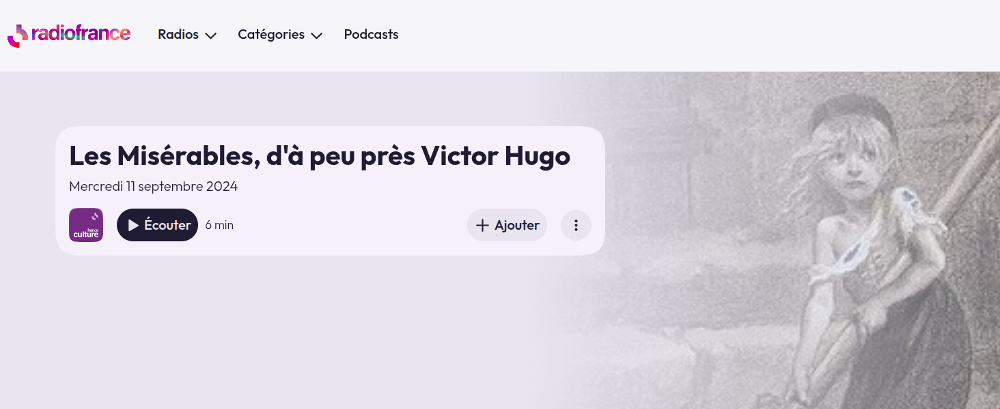<!-- .element: style="width:45%;float:right;margin-right:-1em;" -->

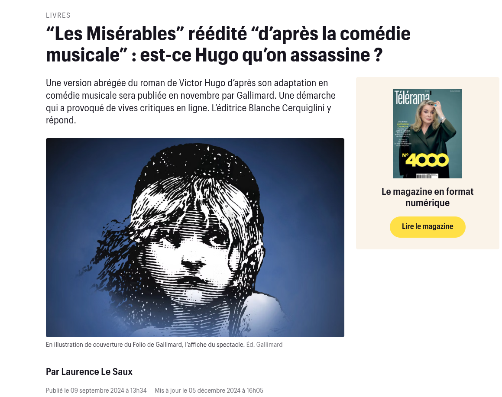<!-- .element: style="width:45%;float:left;margin-right:-1em;" -->

===

Polémique de la rentrée littéraire 2024 : la fuite, dans la presse, de cette couverture des *Misérables* "d'après la comédie musicale" sucite l'émoi sur les réseaux sociaux et dans la presse. À l'occasion de la sortie au Théâtre du Châtelet d'une version remaniée de la Comédie musicale "Les Misérables", écrite et mise en scène par Alain Boulbil et Claude-Michel Schönberg, les éditions Gallimard avaient proposé une réédition en format abrégé du classique de Victor Hugo (415 pages, alors que "l'original" fait tout de même 1300 pages). La polémique sera telle que Gallimard revoie sa copie et se contente tout simplement de la mention "version abrégée". 

§§§§§§§§§§§§§§§§§§§§§§§§§§§§§§§§§§§§§§§§§§§§§

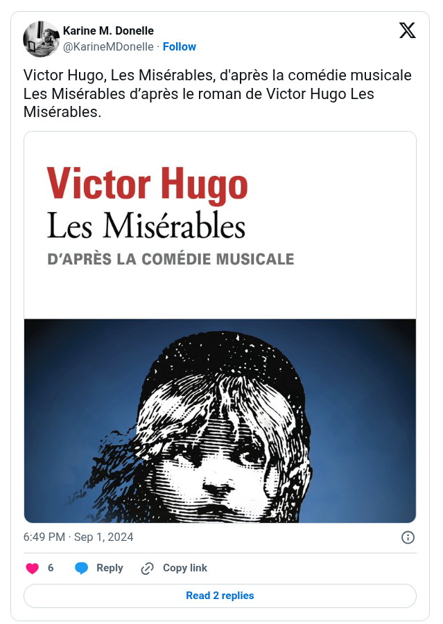

===

Qu'est-ce qui n'allait pas dans cette couverture ? On peut sans doute reprocher à Gallimard une certaine forme d'opportunisme motivé par une stratégie marketting. Mais ce qui a choqué, ici, c'est la transgression d'une conception romantique de l'oeuvre littéraire qui valorise l'originalité ainsi que l'originarité des oeuvres. L'intertextualité, ce ce point de vue, est un concept fort utile qui cherche depuis plus d'un demi-siècle à dépasser cette vision sacralisante de la littérature, en reconnaissant qu'un oeuvre s'inscrit toujours quoiqu'il arrive dans un tissu de références plus ou moins conscientes, plus ou moins assumées par leurs auteurs. Ce que nous enseigne d'abord cette anecdote, c'est que l'intertextualité demeure un concept pertinent, dans un contexte contemporain où la désacralisation de l'oeuvre et de l'auteur n'a pas complètement eu lieu, quoiqu'on en dise.

§§§§§§§§§§§§§§§§§§§§§§§§§§§§§§§§§§§§§§§§§§§§§

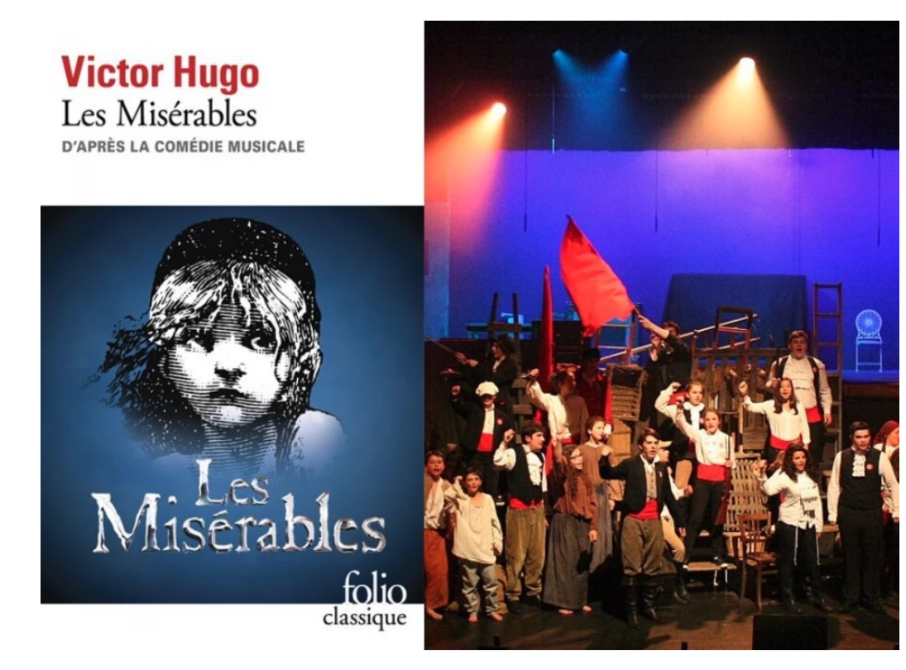

===

Cela étant dit, l'intertextualité défend bien souvent une logique relationnelle qui n'échappe pas à une certaine tendance à l'essentialisation : A influence B, qui influence C, qui influence D, selon un déroulement chronologique et téléologique. Pour le dire en deux mot : *Les Misérables*, c'est le texte de Victor Hugo, publié en 1862, 1300 pages. Ce roman, par la suite, a fait l'objet de plusieurs rééditions, dont certaines abrégées, mais également d'adaptations, au cinéma, à la TV, ou encore dans les salles de spectacle sous la forme d'une comédie musicale -- cette fameuse comédie conçue en 1980 qui a été re-montée en 2024 au Théâtre du Chatelet. Qui dit intertextualité dit également traçabilité, comme pour une pièce de viande ou n'importe quelle autre denrée alimentaire : la traçabilité est une obsession de notre culture contemporaine tous secteurs confondus. Si l'on se fie à cette définition, Gallimard fait ici preuve d'une grande malhonnêteté, puisqu'il présente le texte-source de Victor Hugo (l'hypotexte original et historique, la matrice de toute la tradition des *Misérables*) comme s'il dérivait lui-même de son adaptation musicale. La flèche généalogique classique est totalement inversée, le sens de la mémoire littéraire est chamboulé. 

§§§§§§§§§§§§§§§§§§§§§§§§§§§§§§§§§§§§§§§§§§§§§

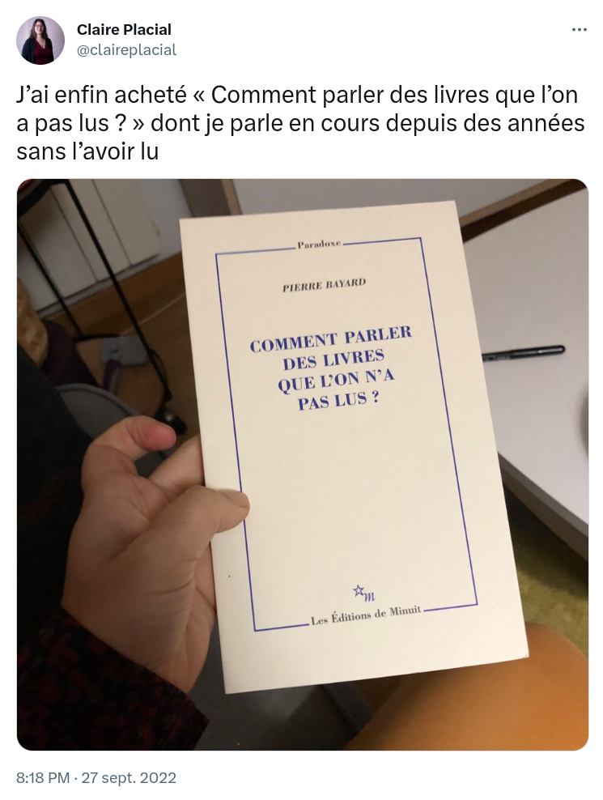

===

Pourtant, je vais tenter dans cette communication de me faire l'avocate du Diable-Gallimard, afin d'aller dans le sens de la proposition de ce colloque et de "reconfigurer" l'intertextualité. Je dois vous faire un aveu : je suis en train, ici de vous mener en bateau, car je n'ai jamais lu l'édition originale et complète des *Misérables* (1300 pages, quand même, ça décourage), et je vous parle donc d'un livre que je n'ai pas lu -- comme Pierre Bayard nous y encourage dans l'un de ses essais bien connus, qui nous montre bien que la mémoire littéraire est un phénomène qui échappe au texte. En vérité, ce que je veux défendre, c'est que *Les Misérables*, ce n'est peut-être pas, ou pas seulement comme on le croit souvent, l'oeuvre de Victor Hugo, en tout cas pas le texte de VH a publié en 1862. *Les Misérables*, c'est peut-être d'abord et avant tout l'intertexte des *Misérables*, qui repose lui-même sur une série d'incarnations médiatiques l'ayant tour à tour reconfiguré, augmenté, transformé au fil temps. 

Ce que j'essaie de proposer ici, c'est une pensée de l'intertextualité qui trouve un ancrage en partie en dehors du texte, dans le média et ses imaginaires qui servent de supports aux textes, un média qui se fait architecture de mémoire littéraire.

§§§§§§§§§§§§§§§§§§§§§§§§§§§§§§§§§§§§§§§§§§§§§

## Positionnements & (légers) déplacements

* \/ *Mobiliser l'intertextualité pour penser l'actualité de la mémoire littéraire*
* \/ *Corpus : des objets encore non-patrimonialisés des avant-gardes littéraires numériques*
* \/ *Concepts : l'intermédialité de l'intextualité*

===

Je profite donc de ma place de dernière conférencière pour me situer de façon un peu oblique par rapport au dyptique intertextualité/HN, en espérant ne pas trop m'inscrire hors du sujet qui nous intéresse. 

Oblique, car ma communication proposera surtout une réflexion sur la notion de mémoire littéraire, en défendant l'idée selon laquelle le concept d'intertextualité reste pertinent pour répondre aux débats qui agitent aujourd'hui la critique autour de la définition même de mémoire littéraire, à condition cependant d'être renouvelé et reproblématisé à la lumière d'un tournant médiatique de la littérature, qui désessentialise la notion de texte.

Oblique, aussi, car ce colloque a bcp traité, en toute logique, du patrimoine littéraire et de ses effets d'écho et de reprises à travers le temps. Or je vais plutôt délocaliser ma réflexion sur le terrain que je connais le mieux, celui de la création contemporaine "outillée" et de la littérature dite "nativement numérique". Les objets littéraires dont je vais parler ne sont pas encore des objets totalement patrimonialisés, et je dirais même que leur patrimonialisation pose problème pour tout un tas de raisons, dont une au moins peut être soulignée : vous entendez que je ne parle déjà pas vraiment de textes littéraires numériques, mais bien d'"objets", et je pourrais également parler de dispositif médiatique. 

Oblique, enfin et surtout, car en raison même de la nature des mes corpus je ne me sens pas véritablement compétente pour parler exclusivement d'intertextualité : ma spécialité étant d'abord l'intermédialité -- à savoir l'étude des relations, des emprunts, des échos entre les médias. Au binôme problématique Humanités numériques et Intertextualité, je vais donc me permettre d'ajouter un troisième larron : l'intermédialité.  

La question de recherche que je vous propose, pour le moment de manière très simplifiée : comment mobiliser la notion d'intertextualité lorsque l'on étudie la création littéraire contemporaine qui se caractérise par ce que la critique appelle un "tournant médiatique" de la littérature (l'expression est de Pascal Mougin) ? Ainsi, qu'est-ce que l'intermédialité ou l'étude des conditions matérielles de production et de transmission des textes, vient apporter à la notion d'intertextualité ? 

§§§§§§§§§§§§§§§§§§§§§§§§§§§§§§§§§§§§§§§§§§§§§

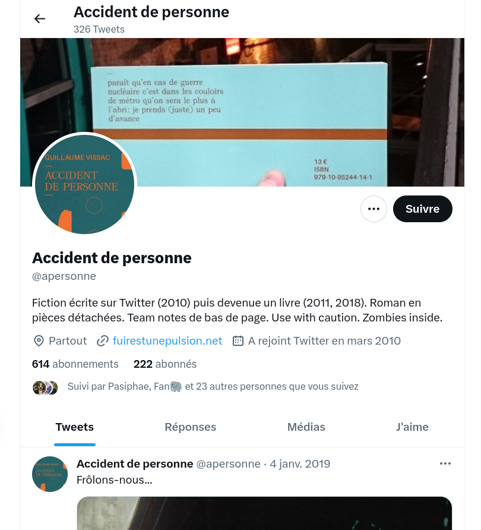<!-- .element: style="width:45%;float:left;margin-right:-1em;" -->

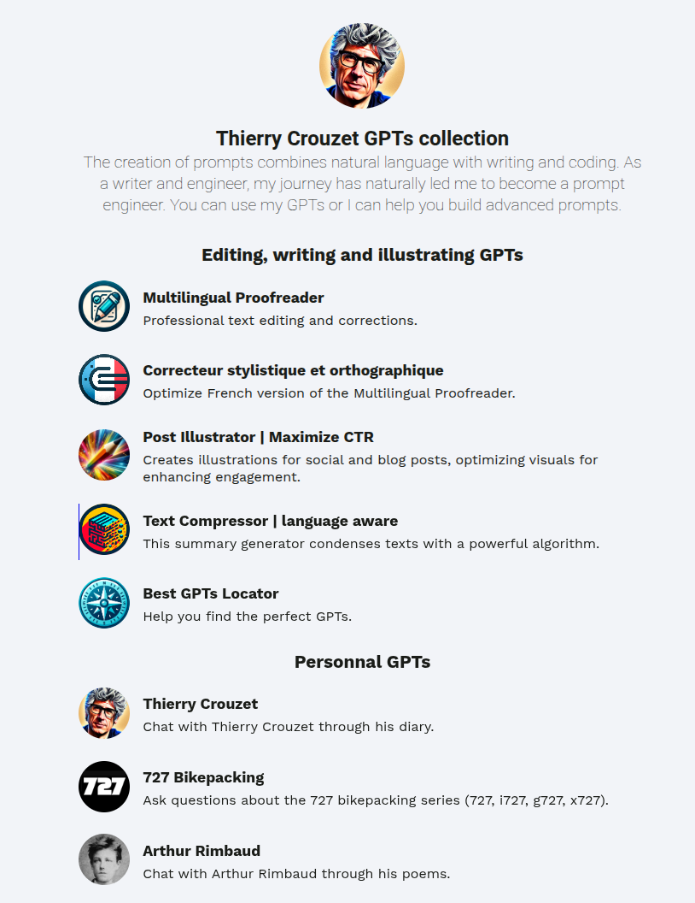<!-- .element: style="width:45%;float:right;margin-right:-1em;" -->

===

Le premier cas d'étude sur lequel je vais me pencher est celui de la remédiation multiple d'une oeuvre littéraire (accident de personne de Vissac), qui semble être un cas limite, avec lequel je me suis beaucoup débattue pour préparer cette communication. Accident de personne est une oeuvre qui, comme beaucoup de ses contemporaines, a connu pour le dire simplement plusieurs "versions" -- appelons-les ainsi pour le moment -- des versions portées par des processus de remédiation qui ne sont pas seulement de simples changements de formats, mais aussi des réécritures du texte. C'est en d'autres termes un cas complexe, à la frontière entre le processus auto-référentiel de type endogénétique comme on a pu le qualifier en génétique des textes, et les phénomène d'auto-intertextualité (Ricardou ou Claude Simon) ou encore d'intertextualité autarcique (Dällenbach), parfois plus simplement appelée auto-textualité. 

Le deuxième axe de réflexion, un peu plus exploratoire, m'ammènera du côté des LLM et du terrain miné des productions littéraires conçues avec des LLM : je m'appuierai sur le cas de l'écrivain Thierry Crouzet. Cette dernière incursion me permettra de problématiser l'actualité de l'intertextualité dans le champs des avant-gardes littéraires qui travaillent avec les IAG, et d'ouvrir le débat sur la reconfiguration de la mémoire littéraire. 

§§§§§§§§§§§§§§§§§§§§§§§§§§§§§§§§§§§§§§§§§§§§§

## I. Pour une pensée intermédiale de l'intertextualité 

Quelles architectures de mémoires se logent aux creux de nos outils d'écriture, de lecture et d'analyse des oeuvres littéraires ? 

Que cache l'*inter* de l'intertextualité ?

===

Mon fil directeur, qui m'inscrit dans une perspective propre aux humanités numériques, sera réflexion sur les architectures de mémoires qui se logent aux creux de nos outils d'écriture, de lecture et d'analyse des oeuvres littéraires. Si l'intertextualité est souvent mobilisée pour interroger le concept même de texte, je voudrais m'occuper du sens même de l'"inter", de ce qui se place entre les textes et les lecteurs, entre les textes eux-mêmes : leur matérialité et leur condition médiatique d'existence. 

Comme le problématise l'appel de ce colloque, la notion d'intertextualité est un "objet théorique" mouvant, qui oscille entre une définition "stricte" (qui permet d'expliciter une relation directe entre un hypotexte et un hypertexte), et une définition inclusive, qui recoupe les allusions, les références implicites, les cadres génériques, culturels ou linguistiques.

De ce point de vue, et ce colloque l'a démontré, les HN ont choisi leur camp, en permettant d'ouvrir la liste des critères de l'intertextualité, mais également de faciliter leur repérage.

§§§§§§§§§§§§§§§§§§§§§§§§§§§§§§§§§§§§§§§§§§§§§

### Le paradoxe de l'intertextualité

>[L'intertextualité] prétend redéfinir les conditions de la lisibilité même des textes et convertir notre regard sur les œuvres littéraires, en nous engageant à les concevoir non comme des entités isolées, closes sur elles-mêmes ou sur un petit domaine de références, mais comme les éléments d’un système relationnel de dépendances mutuelles généralisées. (de Biasi, 2020)

===

Il me semble pourtant que le concept d'intertextualité porte en lui, quoiqu'il arrive, un paradoxe. Il nous pousse en effet, et fort heureusement, à désessentialiser le texte qui compose toute oeuvre littéraire, en insistant sur le rôle joué par la mémoire littéraire : 

>[L'intertextualité] prétend redéfinir les conditions de la lisibilité même des textes et convertir notre regard sur les œuvres littéraires, en nous engageant à les concevoir non comme des entités isolées, closes sur elles-mêmes ou sur un petit domaine de références, mais comme les éléments d’un système relationnel de dépendances mutuelles généralisées. (de Biasi, 2020)

Cette mémoire peut être à la fois collective et personnelle, consciente ou inconsciente, comme l'a montré Kristeva. Elle vient toucher concrètement à une expérience singulière de lecture, mais aussi une expérience de non-lecture (je n'ai pas lu l'Intégralité des *Misérables*, mais cette oeuvre occupe une place majeure dans ma mémoire littéraire car j'en ai entendu parler, j'en ai lu des version abrégées, des extraits et vu des adaptations). Cette mémoire exerce quoiqu'il arrive une influence sur notre écriture, mais également sur notre lecture et notre compréhension des oeuvres en général. 

Mais en inscrivant l'oeuvre dans un réseau de textualités, l'intertextualité, même quand elle est comprise de manière "inclusive", a tendance à focaliser l'attention des chercheurs et des lecteurs sur le texte. Le texte demeure le comparable pour mesurer un phénomène de mémoire littéraire dont on entrevoit la complexité, mais qui manque certainement de prise pour être appréhendé dans son ensemble. 

§§§§§§§§§§§§§§§§§§§§§§§§§§§§§§§§§§§§§§§§§§§§§

Où se loge alors la mémoire littéraire ? 

* Dans l'oeuvre -- conçue comme une entité virtuelle qui n'existe dans aucun état matériel particulier, mais pour lequel on peut identifier, parfois rétrospectivement et génétiquement, une série de matériaux et d'états ayant conduit à la publication d'un objet littéraire -- disons un livre ? 
* Dans les corpus, c'est-à-dire déjà dans les réseaux de textes que nous construisons de manière toujours plus ou moins biaisée ? 
* Dans les outils que nous utilisons pour déterminer et analyser les relations intertextuelles ?

===

C'est ce paradoxe que je souhaite adresser aujourd'hui : si l'intertextualité désessentialise le texte, mais que la mesure de la mémoire littéraire a besoin du texte comme unité stable, alors où se loge alors cette mémoire ? Dans l'oeuvre -- conçue comme une entité virtuelle qui n'existe dans aucun état matériel particulier, mais pour lequel on peut identifier, parfois rétrospectivement et génétiquement, une série de matériaux et d'états ayant conduit à la publication d'un objet littéraire -- disons un livre ? Dans les corpus, c'est-à-dire déjà dans les réseaux de textes que nous construisons de manière toujours plus ou moins biaisée ? Ou même, et c'est là je crois le point d'attention que l'on doit avoir lorsque l'on pratique les Humanités numériques, dans les outils que nous utilisons pour déterminer et analyser les relations intertextuelles ? La réponse se situe certainement à chacun de ces trois niveaux, tous travaillés à leur manière par leur matérialité. C'est à l'étude de cette matérialité que l'intermédialité peut apporter une contribution spécifique à l'intertextualité et aux HN. 

§§§§§§§§§§§§§§§§§§§§§§§§§§§§§§§§§§§§§§§§§§§§§

### De *Toutes sortes de misérables*... 

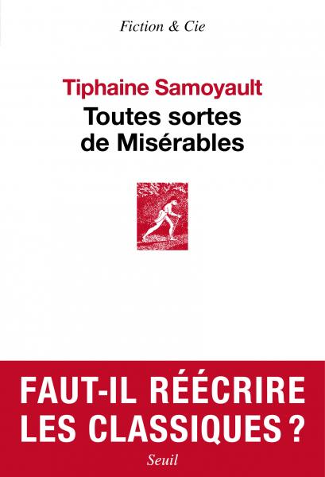<!-- .element: style="width:45%;float:right;margin-right:-1em;" -->

>[Un] classique se définit moins par sa permanence que par sa mutabilité. L'oeuvre dure parce qu'elle s'adapte aux changements d'époque et non parce que son autorité lui vient de sa matière même, inaltérable. [La] définition même de la littérature est engagée dans ce débat : si, comme je le souhaite, on refuse d'en faire seulement un patrimoine, soit une monumentalité immuable et sacrée, mais qu'on choisisse de la voir comme quelque chose de vivant, comme un ensemble de variations, internes et externes, alors les récritures et les adaptations ne l'altèrent pas toujours, mais la font exister.

<!-- .element: style="width:45%;float:left;margin-left:-1em; font-size:1.4rem; text-align:justify" -->

>Tiphaine Samoyault, *Toutes sortes de Misérables*, 2026.

<!-- .element: style="width:45%;float:left;margin-left:-1em; font-size:1.4rem; text-align:justify" -->

===

Début 2026, Typhaine Samoyault, elle-même spécialiste de l'intertextualité, a publié l'ouvrage *Toutes sortes de Misérables* dont on a beaucoup parlé dans le champ des études littéraires. L'un des objectifs annoncés de cet essai consiste à répondre à la question devenue aujourd'hui éminement politique "Faut-il réécrire les classiques ?" Il s'agit, en creux, de proposer des arguments pour répondre aux accusations de censure imputées à ce qu'il est coutume d'appeler aujourd'hui la _cancel culture_ soi-disant prompte à réécrire les oeuvres du passé pour les adapter à notre culture contemporaine. 

Typhaine Samoyault, qui s'appuie comme vous l'aurez compris sur l'exemple des *Misérables*, revient sur la polémique de 2024. Si elle regrette elle aussi l'opportunisme de Gallimard, elle rejette cependant la tentation d'essentialisation du "classique" littéraire, pour aller jusqu'à proposer une conception de l'instabilité comme condition du canon :

>"un classique se définit moins par sa permanence que par sa mutabilité. L'oeuvre dure parce qu'elle s'adapte aux changements d'époque et non parce que son autorité lui vient de sa matière même, inaltérable." 

>"la définition même de la littérature est engagée dans ce débat : si, comme je le souhaite, on refuse d'en faire seulement un patrimoine, soit une monumentalité immuable et sacrée, mais qu'on choisisse de la voir comme quelque chose de vivant, comme un ensemble de variations, internes et externes, alors les récritures et les adaptations ne l'altèrent pas toujours, mais la font exister."

En d'autres termes, le texte n'existe pas, mais la mémoire des textes existe. Et plus un livre est transformé, réécrit, adapté, abrégé, traduit... c'est-à-dire plus il multiplie les effets d'auto-textualité, plus il devient mémorable.

Pour porter cette conception de la littérature, Typhaine Samoyault met en place une méthode, qui consiste à nous présenter ses différences lectures des *Misérables* de Hugo : le chapitre "Trois fois *Les Misérables*" revient sur la lecture d'une édition abrégée pour enfant (Lecture et loisir), la lecture d'une édition complète en trois volumes chez Folio, et enfin une lecture d'une édition Pléiade. 

Trois lectures impliquant différentes énonciations éditoriales, mais également différents textes (le texte de Hugo lui-même remanée, mais également l'apparat critique qui accompagne ce texte), et, surtout, trois âges de lectrice. Faire l'expérience du canon littéraire, c'est pouvoir démultiplier les lectures d'une oeuvre. Typhaine Samoyault insiste beaucoup sur cette démultiplication, qui relève de la vie éditoriale du texte : ses éditions abrégées pour enfant, ses traductions, bref l'ensemble de ses réécritures qui ne doivent pas être confondues avec des récritures (lesquelles relèvent en effet potentiellement d'un fait de censure).

Je voudrais à la fois reprendre à mon compte les propos de Typhaine Samoyault tout en ouvrant davantage encore son propos : ce qui se joue dans ces multiples _versions_ du texte, c'est également une expérience médiatique différente. Ainsi faut-il, à mon sens, concevoir l'intertextualité à la lumière d'une herméneutique matérielle que permet l'intermédialité.

§§§§§§§§§§§§§§§§§§§§§§§§§§§§§§§§§§§§§§§§§§§§§

### ...à toutes sortes de computables

Chaque remédiation dans un dispositif computationnel distinct -- qui vaut pour architecture de mémoire -- transforme la notion même de mémoire de l'oeuvre, et de mémoire littéraire.

===

Sur le modèle entrouvert par Typhaine Samoyault, je souhaiterais vous présenter une méthode qui retrace une histoire de mes différentes expériences de lectures, en insistant sur l'influence médiatique des dispositifs matériels utilisés pour créer, diffuser mais également lire les oeuvres nativementr numériques. 

À partir de cette proposition intitulée "toutes sortes de Misérables", je vous parlerai donc une réflexion sur "toutes sortes de computables", en restant fidèle à une tradition intermédiale McLuhanienne, qui nous intime de comprendre le "message" porté par chacune de ces médiations et plus particulièrement de ces remédiations numériques qui forment à la fois les oeuvres et la mémoire des oeuvres. Pour rappel, chez McLuhan, la forme ou le media qui transmet une information a plus d'impact sur notre façon de penser que le contenu d'une information elle-même. 

Toutes sortes de computables, donc, pour comprendre comment les opérations de remédiation qui sont nécessaires à la diffusion des textes numériques, en travaillant la notion d'intertextualité et avec elle la notion de mémoire littéraire. Car mon hypothèse est que chacune de ces remédiations dans des dispositifs computationnels qui sont autant d'architectures de mémoires disctinctes, transforment la notion même de mémoire de l'oeuvre, et de mémoire littéraire.

C'est sur cette question du dispositif numérique conçu comme architecture de mémoire que ma proposition s'inscrit résolumment dans le champ des Humanités Numériques, en réflechissant à l'influence épistémologique de nous outils d'écriture, de lecture et d'analyse des oeuvres. 

Ça c'était pour la partie théorique, qui se tient pas trop mal je l'espère, malgré quelques éléments un peu bancals on s'en sort à peu près. Je vais maintenant confronter ces belles paroles à mon terrain, et vous allez voir que ça se complique, parce que j'ai choisi des cas qui sont des cas limites, que j'étudie pour le premier depuis une dizaine d'années, mais qui me donne encore du fil à retordre. 

§§§§§§§§§§§§§§§§§§§§§§§§§§§§§§§§§§§§§§§§§§§§§

## II. Une intertextualité stratigraphique : le cas limite du projet littéraire "Accident de Personne" (Guillaume Vissac)

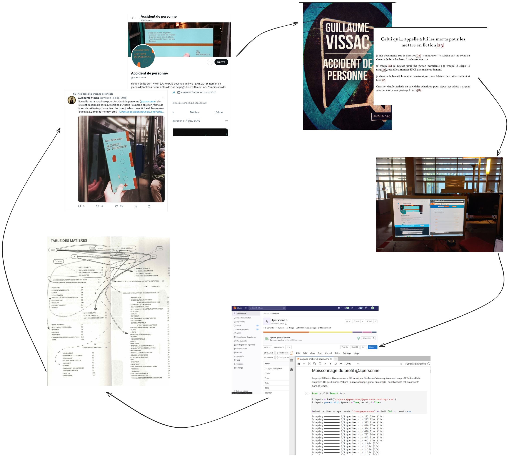

===

Mon premier exemple s'intitule _Accident de personne_ : il s'agit d'un projet littéraire mené par l'écrivain français Guillaume Vissac. Je l'ai lu pas moins de cinq fois, sous cinq formes différentes. 

Dans le cadre de mes travaux sur la littérature numérique, cela fait quelques années que j'ai lâché le concept d'oeuvre, pour le remplacer par celui de projet littéraire : un projet littéraire numérique se déploie sur le temps long, parfois des années. Chez Vissac, on compte près de 8 ans.

Il comprend différent "moments" du texte et de sa production, dont certains peuvent être collaboratifs, puis individuels, puis de nouveaux collectifs. Certains "moments" font l'objet d'une cristallisation, soit de stabilisation du texte, dans des versions, des formes et des formats spécifiques, qui engagent à la fois des mutations du texte, mais également des mutations du dispositif de lecture. 

Cette notion de projet qui force le concept d'intertextualité à sortir de son présupposé mono-médial, dessine en creux un modèle de mémoire qui n'est plus seulement relationnelle, mais stratigraphique. La particularité du projet littéraire est donc qu'il porte en lui sa propre mémoire. Comme je veux le démontrer, chacune des cinq lectures qui suivent n'est donc pas seulement un nouvel état du texte, mais l'occasion de se demander ce que son medium propre fait à la mémoire du projet -- ce qu'il retient, ce qu'il réorganise, ce qu'il laisse irrémédiablement filer.

§§§§§§§§§§§§§§§§§§§§§§§§§§§§§§§§§§§§§§§§§§§§§

## *Accident de personne* sur Twitter : une expérience du réseau 

<!-- .element: style="width:400px" -->

===

Première lecture, accident de personne sur Twitter

À l'origine, *Accident de personne* est une expérience de Twittérature signée Guillaume Vissac, écrivain et éditeur de Publie.net (entre autres activités). 

Je m'y connecte -- geste risqué, quand on sait ce qu'est devenu aujourd'hui X, nouvelle mouture de Twitter à la sauce Elon Musk. 

L'oeuvre se présente sous la forme d'un profil intitulé "Accident de personne", publié sous l'identité profilaire \@apersonne, dont on devine assez rapidement qu'il s'agit de Guillaume Vissac, puisqu'un lien nous renvoie vers le site de l'auteur, *Fuir est une pulsion*. 

Le titre du profil renvoie à un euphémisme propre au jargon de la communication des services ferroviaires, pour annoncer les suicides sur le réseau. Je peux voir sur Twitter que le compte a été essentiellement actif entre Novembre 2010 et Janvier 2011. À cette une époque, Twitter est encore Twitter, c'est-à-dire un réseau social cool, où vont se structurer plusieurs communautés d'écriture : des artistes, des écrivains, des journalistes, des chercheurs. 

§§§§§§§§§§§§§§§§§§§§§§§§§§§§§§§§§§§§§§§§§§§§§

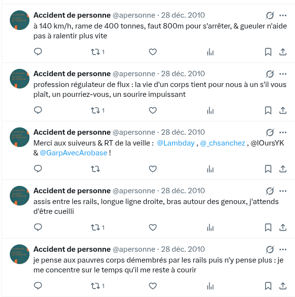<!-- .element: style="width:400px" -->

===

Accident de personne est une oeuvre de Twittérature.

Formellement, la twittérature sera d'abord définie comme une forme d'écriture à contrainte : celle de la brièveté. En 2010, la norme encore imposée de 140 caractères maximum, et le passage à 280 à partir de 2017 ne change pas-grand-chose sur le fond. On le constate avec l'expérience de Vissac, dont les textes sont donc très courts, généralement une phrase ou comme un morceau de phrase interrompu, voire pioché à la volée, puisqu'il n'y a ni majuscule ni point. Je vous en lis un extrait : 

>assis entre les rails, longue ligne droite, bras autour des genoux, j'attends d'être cueilli (28 décembre)

>profession régulateur de flux : la vie d'un corps tient pour nous à un s'il vous plaît, un pourriez-vous, un sourire impuissant (28 décembre)

§§§§§§§§§§§§§§§§§§§§§§§§§§§§§§§§§§§§§§§§§§§§§

### Sauf qu'en vérité...

...Je n'ai pas (vraiment) lu _Accident de personne_ sur le profil @apersonne

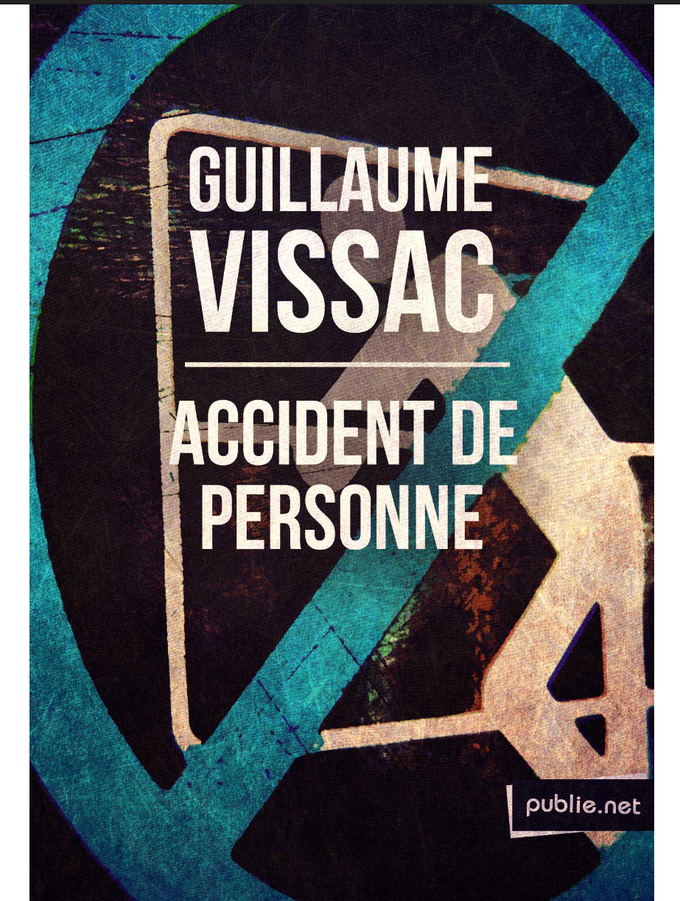<!-- .element: style="width:150px" -->

===

Avant d'aller plus loin, il me faut vous faire un aveu : je n'ai **pas** lu les publications du profil en temps réel, pour la bonne raison que je n'avais encore de profil Twitter à cette époque, en 2010. 

Je ne me rappelle plus très bien du moment où je lis pour la première fois *Accident de personne*, mais c'est sans doute déjà en 2014, et pour tout vous dire je vais la découvrir non pas sur Twitter, mais dans une republication sur remue.net en version epub. Mais comme il y a déjà un hiatus entre la chronologie de l'oeuvre et la chronologie de ma lecture, je reste pour le moment sur le profil, et je vous retrouve ensuite avec mon epub.

§§§§§§§§§§§§§§§§§§§§§§§§§§§§§§§§§§§§§§§§§§§§§

<!-- .element: style="width:500px" -->

===

Lorsque je consulte pour la première fois le profil Twitter d'@apersonne, c'est donc bien après la bataille, et je trouve en fait déjà un profil éditorialisé, ainsi qu'un projet littéraire terminé. Sur le bandeau de présentation du profil, je peux lire :

>Fiction écrite sur Twitter (2010) puis devenue un livre (2011). Roman en pièces détachées. Team notes de bas de page. Use with caution. Zombies inside.

§§§§§§§§§§§§§§§§§§§§§§§§§§§§§§§§§§§§§§§§§§§§§

<!-- .element: style="width:400px" -->

===

Ma lecture du profil n'est pas très confortable : comme vous en avez déjà fait l'expérience ici ou ailleurs, je ne peux lire le texte qu'en ordre anté-chronologique. Je commence par la fin, je remontre en scrollant laborieusement vers le "début", c'est-à-dire vers le fond du profil. Je m'aperçois rapidement que les tweets étaient publiés à heure fixe : 7h, 9h, 12h, 18h et 20h, ce qui laisse supposer un caractère feuilletonnesque assez inédit sur le réseau (ou le flux de publication était justement plutôt irrégulier, avec des pics en fonction de la popularité des sujets ou de l'actualité). Je vois également des traces d'éditorialisation propre aux RSN, avec des retweets, des citations, des mentions à d'autres profils du réseau, des hashtag, ainsi que des liens externes, souvent vers YouTube. 

Ma lecture, ici, n'est pas tant celle d'une oeuvre que celle des traces d'une oeuvre littéraire en ligne, conçue pour être au coeur d'une performance d'écriture, mais également d'une performance algorithmique et profilaire. 

Lire aujourd'hui le profil \@personne c'est faire une double expérience un peu contradictoire. Celle, d'abord, de cette forme très spécifique d'écriture qu'est le micro-blogging avec ses effet d'instantanéité, de fragmentarité, de réseau, de flux, de collectif. Mais c'est aussi déjà faire l'expérience de la dimension très conjoncturelle et transitoire de ce qui se passe sur les réseaux : certains liens sont morts ; des profils cités ont disparu, après avoir déserté Twitter. Je peux encore lire à l'envers les publication du profil, mais son intéractivité n'est plus d'acturalité : quel sens y aurait-il ici à retweeter une phrase ? À répondre à un commentaire ? Sans doute aucun. La performance est terminée.

Le geste d'écriture est clôt, et celui de lecture (prévu pour être lui aussi un geste d'écriture) est empêché.

§§§§§§§§§§§§§§§§§§§§§§§§§§§§§§§§§§§§§§§§§§§§§

## *Accident de personne* en epub chez publie.net : une lecture anthologique 

<!-- .element: style="width:300px" -->

===

La vraie première fois que j'ai lu *Accident de personne*, c'est dans sa version epub de publie.net, une version que m'a donnée Marcello Vitali-Rosati qui l'avait achetée, et qui n'était pas soumise à des DRM. Cette republication engage de fait une remédiatisation de l'oeuvre, qui va aboutir à trois effets très importants à mon sens : 

* Une documentation du projet twittéraire via l'ajout d'une préface
* Une curation des tweets réorganisés par thématiques et surtout par personnages
* Une navigation hypertextuelle permise par le format epub

Le geste de lecture proposé est totalement différent. On va voir qu'il est organisé et hypertextualisé. 

§§§§§§§§§§§§§§§§§§§§§§§§§§§§§§§§§§§§§§§§§§§§§

>Pendant presque deux ans, je passais entre deux et trois heures par jour en transport en commun (RER, métros). Tout ce temps-là, mis bout à bout, ça fout la lourde comme on dit par chez moi, le vertige. J’ai donc eu mon compte d’accidents de personne, je ne les ai pas comptés, mais toujours une atmosphère particulière dans le wagon lorsque le conducteur l’annonce, ou sur les quais quand les écrans clignotent. Un jour l’un d’entre eux m’a fait arriver deux heures en retard dans mon boulot de l’époque. Ce jour-là, l’idée d’en faire quelque chose, de prendre des notes, et l’écriture de la toute première.

Guillaume Vissac, *Accident de personne*, version epub, 2011, préface

<!-- .element: style="font-size:1.5rem; text-align:right" -->

===

Je me permets de citer un peu longuement la préface, qui explicite la genèse du projet et le rend en vérité bien plus clair que sur la plateforme Twitter elle-même : 

>Pendant presque deux ans, je passais entre deux et trois heures par jour en transport en commun (RER, métros). Tout ce temps-là, mis bout à bout, ça fout la lourde comme on dit par chez moi, le vertige. J’ai donc eu mon compte d’accidents de personne, je ne les ai pas comptés, mais toujours une atmosphère particulière dans le wagon lorsque le conducteur l’annonce, ou sur les quais quand les écrans clignotent. Un jour l’un d’entre eux m’a fait arriver deux heures en retard dans mon boulot de l’époque. Ce jour-là, l’idée d’en faire quelque chose, de prendre des notes, et l’écriture de la toute première.

§§§§§§§§§§§§§§§§§§§§§§§§§§§§§§§§§§§§§§§§§§§§§

>La prise de notes a duré un an et demi. Toutes ces notes (ou la plupart) ont été écrites directement embarqué soit dans les wagons, soit sur les quais, au téléphone portable classique, ensuite via l’iPhone. [\...] Fin 2010, j’avais plus de 200 fragments d’écrits, tous de moins de 140 caractères, alors j’ai créé le compte @apersonne, j’ai épuré mon texte. J’en ai gardé environ 160. De cette façon, j’ai pu mettre en ligne 5 fragments par jour pendant un mois tout juste. C’était novembre, j’ai choisi décembre, et ça tombait bien avec Noël et réveillon à la fin comme acmé. L’idée était là depuis le tout début, de pouvoir programmer les twitts à heure fixe, tous les jours 7h, 9h, 12h, 18h et 20h, afin que les twitts puissent être lus aux heures de pointe, dans les transports précisément. Et puis ça avait un côté feuilleton : les followers ont commencé à savoir que c’était « bientôt l’heure d’@apersonne ».

Guillaume Vissac, *Accident de personne*, version epub, 2011, préface

<!-- .element: style="font-size:1.5rem; text-align:right" -->

===

>La prise de notes a duré un an et demi. Toutes ces notes (ou la plupart) ont été écrites directement embarqué soit dans les wagons, soit sur les quais, au téléphone portable classique, ensuite via l’iPhone. [\...] Fin 2010, j’avais plus de 200 fragments d’écrits, tous de moins de 140 caractères, alors j’ai créé le compte @apersonne, j’ai épuré mon texte. J’en ai gardé environ 160. De cette façon, j’ai pu mettre en ligne 5 fragments par jour pendant un mois tout juste. C’était novembre, j’ai choisi décembre, et ça tombait bien avec Noël et réveillon à la fin comme acmé. L’idée était là depuis le tout début, de pouvoir programmer les twitts à heure fixe, tous les jours 7h, 9h, 12h, 18h et 20h, afin que les twitts puissent être lus aux heures de pointe, dans les transports précisément. Et puis ça avait un côté feuilleton : les followers ont commencé à savoir que c’était « bientôt l’heure d’@apersonne ».

Sans revendiquer explicitement le genre Tweetéraire, la préface insiste sur l'importance du réseau, et plus largement d'un contexte technique et méditique d'écriture et de lecture. On y apprend que le smartphone aura servi de support d'écriture (dans une déclinaison des poèmes de métro oulipiens). 

§§§§§§§§§§§§§§§§§§§§§§§§§§§§§§§§§§§§§§§§§§§§§

>tous penchés sur leurs tactiles, écrans, scanners de poche : combien pour voir derrière eux le bourreau & au dessus la hache ?

Guillaume Vissac, *Accident de personne*, "Ceux qui… ne font pas attention", version epub, 2011

<!-- .element: style="font-size:1.5rem; text-align:right" -->

===

C'est également sur le téléphone que Guillaume Vissac imaginait que son travail devait être lu, puisque l'objectif était de connecter et de rassembler tous les lecteurs à heure fixe pour suivre le feuilleton -- assertion paradoxale au sein même d'un ouvrage au format epub. Un fragment commente avec ironie cette scènce imaginée par l'auteur :

>tous penchés sur leurs tactiles, écrans, scanners de poche : combien pour voir derrière eux le bourreau & au dessus la hache ?

§§§§§§§§§§§§§§§§§§§§§§§§§§§§§§§§§§§§§§§§§§§§§

>Passé fin décembre, j’ai mis au propre, rassemblé le tout dans un abécédaire. A l’origine il n’était pas prévu que des figures émergent, et puis des personnages sont apparus d’eux mêmes, par exemple celui qui cherche une chanson idéale pour la passer au moment de mourir, celle qui se tue mais plusieurs fois, car ça marche pas, les régulateurs de flux que je voyais tous les jours deux fois par jour, etc. Alors les classer par personnages, c’était une idée. Les notes de bas de page, c’est venu pendant cette phase là, histoire de faire dialoguer tout le monde, du coup toutes les notes sont inédites, jamais apparues sur twitter, plus de 140 caractères pour certaines.

Guillaume Vissac, *Accident de personne*, version epub, 2011, préface

<!-- .element: style="font-size:1.5rem; text-align:right" -->

===

Guillaume Vissac poursuit son explication : 

>Passé fin décembre, j’ai mis au propre, rassemblé le tout dans un abécédaire. A l’origine il n’était pas prévu que des figures émergent, et puis des personnages sont apparus d’eux mêmes, par exemple celui qui cherche une chanson idéale pour la passer au moment de mourir, celle qui se tue mais plusieurs fois, car ça marche pas, les régulateurs de flux que je voyais tous les jours deux fois par jour, etc. Alors les classer par personnages, c’était une idée. Les notes de bas de page, c’est venu pendant cette phase là, histoire de faire dialoguer tout le monde, du coup toutes les notes sont inédites, jamais apparues sur twitter, plus de 140 caractères pour certaines.

Cette curation des contenus à l'intérieur de l'objet livre, qu'il soit numérique ou imprimé, permet comme le dit Vissac la création de personnages, qui vont permettre une structuration en chapitre de l'ouvrage, avec des titres à mi-chemin entre l'hagiographie antique et les épisodes de friends : "Celui qui… a du mal à assumer", "Celui qui… a le sens de la formule", "Celui qui… a le sens de la mise en scène", "Celui qui… travaille plus pour gagner plus".

§§§§§§§§§§§§§§§§§§§§§§§§§§§§§§§§§§§§§§§§§§§§§
<!-- .slide: data-background-video="img/accidentDePersonneEpub.webm" data-background-size="contain" -->

===

Un exemple : 

>Celui qui… appelle à lui les morts pour les mettre en fiction[23] 
>je me documente sur la question[24]  : synonymes : « suicide sur les voies de chemin de fer » & « hasard
malencontreux » 
>je traque[25] le suicidé pour ma fiction minuscule : je traque le corps, le sang[26], recueille annonces SNCF par un
rictus dément 
>je cherche la beauté humaine : anatomique : vue éclatée : les rails cisaillent si bien[27] 
cherche viande malade de suicidaire plastique pour reportage photo : urgent me contacter avant passage à l’acte[28] 

Cette linéarité est cependant détournée en partie par un système de notes et de renvois cliquables, qui viennent ajouter une structure narrative plus complexe, avec des effets d'échos, d'ironie, de détournement. Par exemple, pour la note 24 de "je me documente sur la question" :

>[24] Cette question je me la pose encore. Un moteur de recherche à l’algorithme idéal est-il seulement capable de
m’apporter un début de réponse ? (Celui ou celle qui hésite).

Et la note termine par un renvoi à un autre chapitre, proposant ainsi un parcours de lecture qui rompt avec la linéarité traditionnelle du livre. L'expérience de lecture, ici, est donc une expérience hypertuelle, qui joue sur les potentialités du format epub, format souvent décrié pour son côté homothétique, mais qui démontre ici une capacité à rendre plus lisibles les écritures profilaires, en dehors de leur interface d'origine.

§§§§§§§§§§§§§§§§§§§§§§§§§§§§§§§§§§§§§§§§§§§§§

## *Accident de personne* dans les archives de l'Internet et du Web : l'expérience patrimoniale (et frustrante)

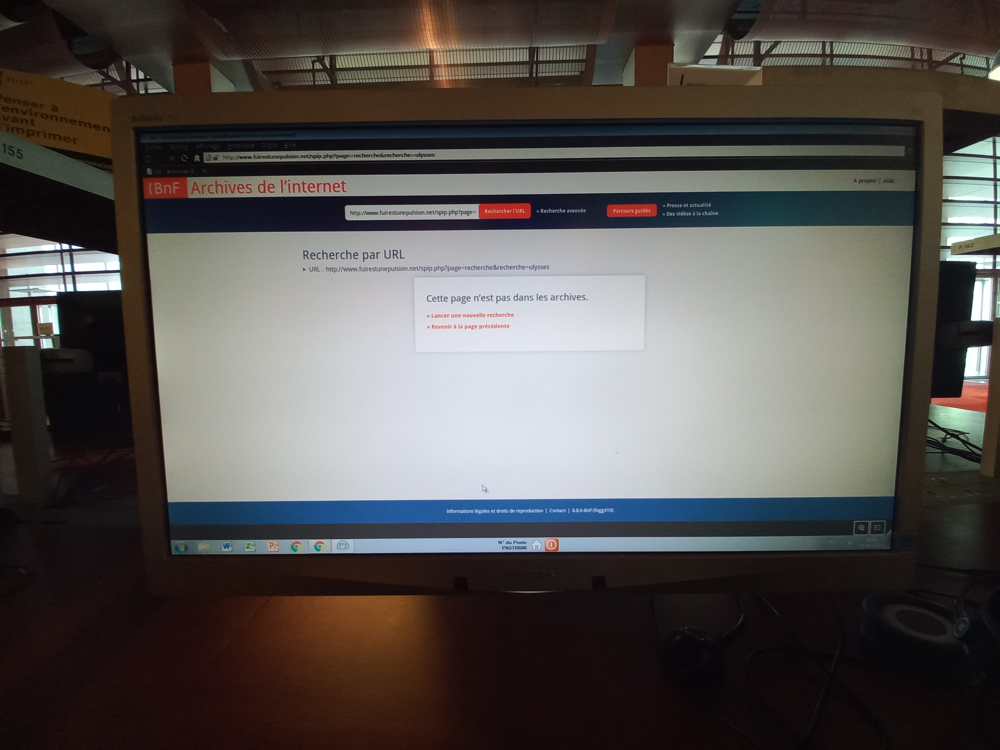<!-- .element: style="width:500px" -->

===

Je vais passer un peu plus rapidement à présent sur une autre lecture à la fois importante, mais assez peu probante. Pour les chercheurs en littérature et culture numérique, il existe un outil essentiel : les archives de l'Internet et du Web, qui sont collectées systématiquement par la BNF et l'INA depuis 2006, suite à la loi DAVDSI de 2004, pour une mémoire des contenus nativement numérique. 

Il existe à la BN des postes de consultation spécialement conçu pour les archives du web. Ces postes présentent une interface qui rappelle la page d'accueil d'un moteur de recherche courant. Le potentiel de recherche demeure cependant très limité, puisque vous êtes obligé d'entrer directement une url précise pour avoir accès à son archive. 

§§§§§§§§§§§§§§§§§§§§§§§§§§§§§§§§§§§§§§§§§§§§§

<!-- .element: style="width:700px" -->

===

En pratique, cela signifie que vous devez avoir deux fenêtres ouvertes sur votre écran : le moteur de recherche courant, connecté à ce qu'on appelle le web "vivant", et le moteur de recherche de l'archive de l'internet où vous collez l'url copiée préalablement -- vous remarquerez que la symétrie sémantique nous encourage à qualifier de manière un peu malheureuse l'archive de l'internet de "web mort"... ce qui finalement n'est pas si éloigné de la vérité, comme on va le constater.

L'expérience immersive des archives de la BN est plutôt intéressante, en ce qu'elle propose en plus une navigation temporelle au sein des contenus. Une fois que vous avez choisi une page, ou un site, l'interface vous propose en effet de voyager à travers les différents âges de la page, dont l'archive présente une plusieurs versions stratifiées (Valérie Schaffer parle même d'« archive temporelle »). Vous pouvez donc suivre la construction (et parfois la disparition) d'un site sur plusieurs années.

L'interface permet ainsi de rendre compte du processus d'éditorialisation propre aux objets web, et parvient à négocier avec l'impossible stabilisation d'une publication numérique, nécessairement prise dans une dynamique processuelle. Aussi ai-je fait l'expérience de relire @apersonne à travers l'interfaces des archives de l'Internet et du web de la BNF. Cela ne m'a pas pris très longtemps, puisqu'il n'y avait pas grand chose. 

§§§§§§§§§§§§§§§§§§§§§§§§§§§§§§§§§§§§§§§§§§§§§

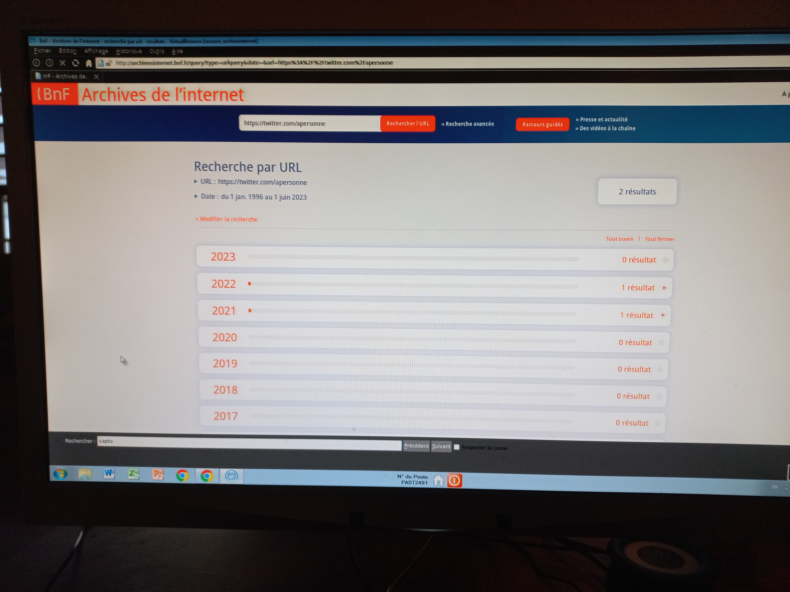<!-- .element: style="width:600px" -->

===

Aucun moissonnage du projet jusqu'à 2021 (je rappelle qu'on est sur un profil actif essentiellement en 2010).

Trois moissonnages seulement, et c'est comme moi en pire : ils sont arrivés bien après la bataille.
- avril 2021, mais incomplet (ne remonte pas au delà du 17 mars 2011 : c'est-à-dire qu'on a aucun tweet littéraire, seulement du discours péritextuel : annonce des republications epub ou imprimée, retweet d'un article consacré au projet et paru dans la presse).
- avril 2022, exactement le même moissonnage, mais peut-être en pire, car en plus des symboles étranges sont apparus sur l'interface.
- 2023

§§§§§§§§§§§§§§§§§§§§§§§§§§§§§§§§§§§§§§§§§§§§§
<!-- .slide: data-background-video="img/BNF-apersonne-figement.mp4" data-background-size="contain" -->

===

Naviguer dans les archives du web, c'est donc un peu naviguer dans un gruyère. Mais surtout, exception faite de cette remédiation de la navigation, l'archive du web laisse souvent un sentiment de figement, qui procède notamment d'une perte majeure d'interactivité avec les objets collectés -- concrètement, de nombreux liens demeurent non-cliquables.

La lecture des archives institutionnelles est donc déceptive, en même temps elle est très importante : quand je constate que l'un de mes corpus est archivé à la BNF, j'en nourris un certain sentiment de légitimité de mon travail, qui a su trouver une reconnaissance patrimoniale -- encore à saisir pour les chercheurs que nous sommes. 

§§§§§§§§§§§§§§§§§§§§§§§§§§§§§§§§§§§§§§§§§§§§§

## *Accident de personne* dans mon notebook jupyter : une lecture distante et outillée

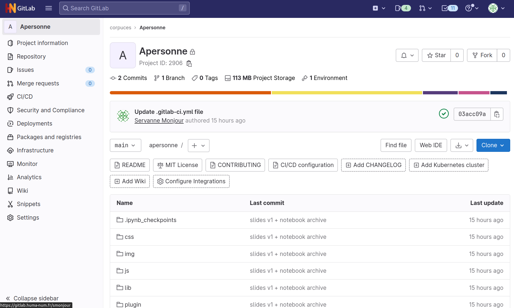<!-- .element: style="width:600px" -->

===

J'en arrive à ma 4e lecture, qui est une lecture distante outillée à l'aide d'un notebook Jupyter, qui m'a servi à moissonner moi-même le corpus Accident de personne, afin d'en proposer aussi quelques visualisations. Cette lecture se caractérise par deux éléments majeurs : 
- elle va considérer la textualité des objets numériques comme un ensemble de données, ou plus précisément de capta, et donc essayer de récupérer, d'organiser et d'analyser les écritures invisibles qui se cachent sous les interfaces numériques. [ILLUSTRATION AVEC UN TWEET]. 
- cette lecture est aussi une écriture, puisqu'elle engage l'élaboration d'un code qui permet de récupérer les données, mais également de les traiter.

§§§§§§§§§§§§§§§§§§§§§§§§§§§§§§§§§§§§§§§§§§§§§

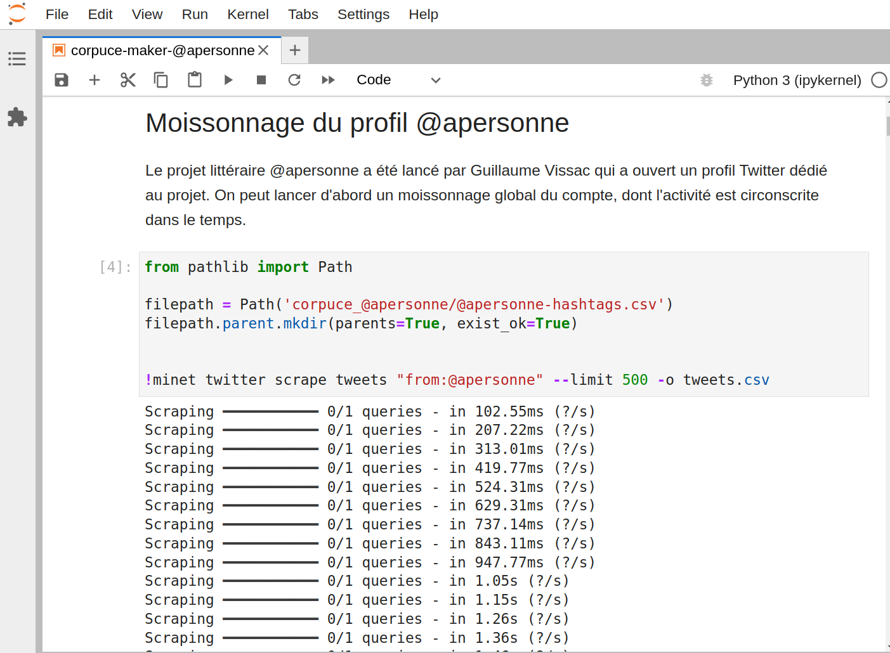

===

Je ne vais pas rentrer dans le code, mais expliquer en 2-3 mots ce qui est intéressant dans cette lecture : 

* Témoignage de l'emmerdification de Twitter : geste politique

Jusqu'en 2023, les chercheurs avaient un accès gratuit à l'API de Twitter. L'accès n'était pas automatique, il fallait présenté un projet de recherche étudié par les ingé de la plateforme. Enfin, c'était possible. Aujourd'hui l'accès existe toujours, mais il est devenu payant. Des solutions ont été mises en place par plusieurs labos pour tenter de contourner la fermeture des API, et depuis plusieurs années on réalise un jeu de chat et de la souris pour récupérer des données de Twitter. On en est arrivés à déployer des techniques qui relèvent du hack et qui sont illégales. En d'autres termes, j'ai ici souvent lu contre la plateforme, contre la twittérature, mais aussi sous la twittérature, au niveau des données. 

§§§§§§§§§§§§§§§§§§§§§§§§§§§§§§§§§§§§§§§§§§§§§

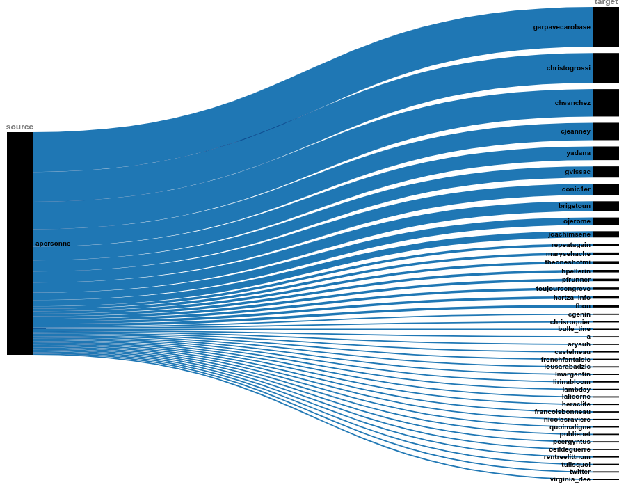

===

* Essai de lecture distante : geste de recul

C'est également une lecture intéressante car elle permet d'explorer le potentiel des lectures "distantes", de la visualisation des données récoltées, à des fins d'analyse. On change ainsi de perspective sur notre corpus, et on explore une autre forme de computabilité, mais également d'autres formes de lisibilité : 
- celle de la donnée
- celle des graphs et autres visualisation 

La lecture distante, c'est une écriture, une écriture qui nous amène à manipuler une autre langue, celle d'un langage de programmation. La notion de corpus, la forme de notre corpus va également évoluer : ici, je me suis dit que le profil @apersonne ne suffisait plus, qu'il fallait aussi voir qui avait mentionné ce profil, car la performance incluait aussi les retweeteurs. 

§§§§§§§§§§§§§§§§§§§§§§§§§§§§§§§§§§§§§§§§§§§§§

## *Accident de personne* en édition imprimée au Nouvel Attila

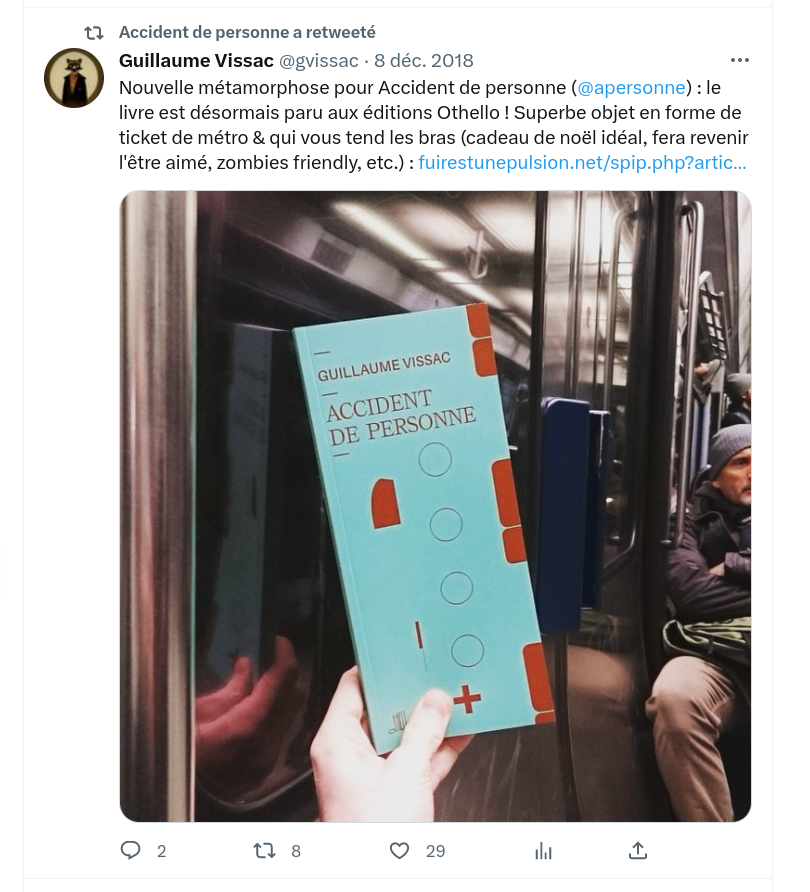<!-- .element: style="width:400px" -->

===

Enfin, dernière lecture : en 2018, publication du livre au Nouvel Attila, label Othello par Benoît Virot.

Dans cette édition, l'énonciation éditoriale insiste davantage sur la mise en scène du métro parisien, avec une couverture qui rappelle le ticket RATP, que sur les origines médiatiques du projet. 

§§§§§§§§§§§§§§§§§§§§§§§§§§§§§§§§§§§§§§§§§§§§§

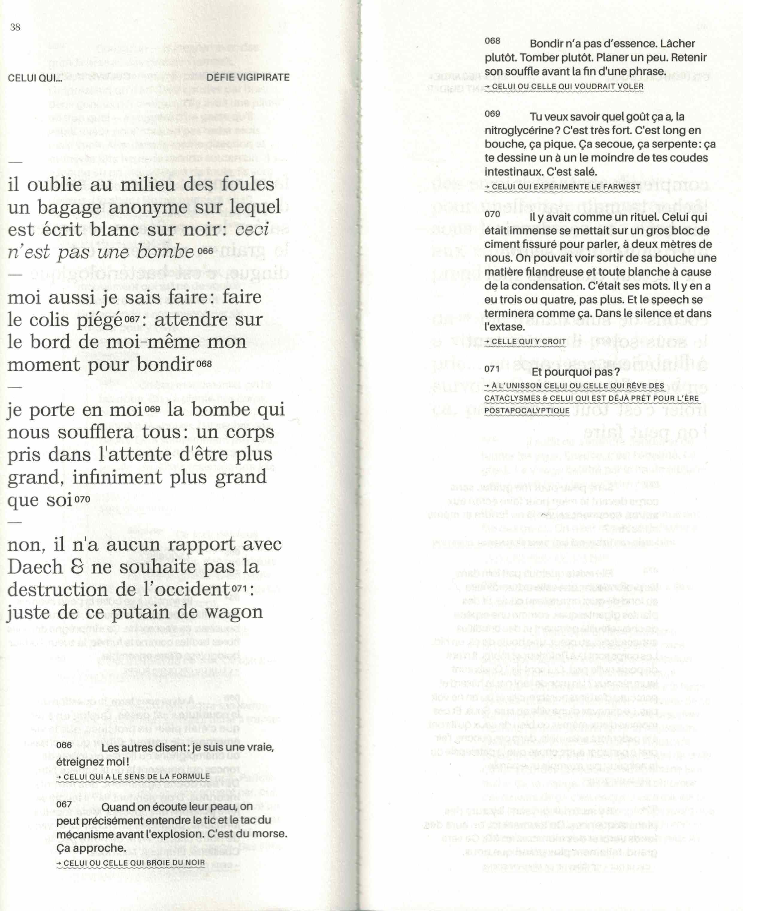<!-- .element: style="width:50%;float:right;margin-right:-1em;" -->

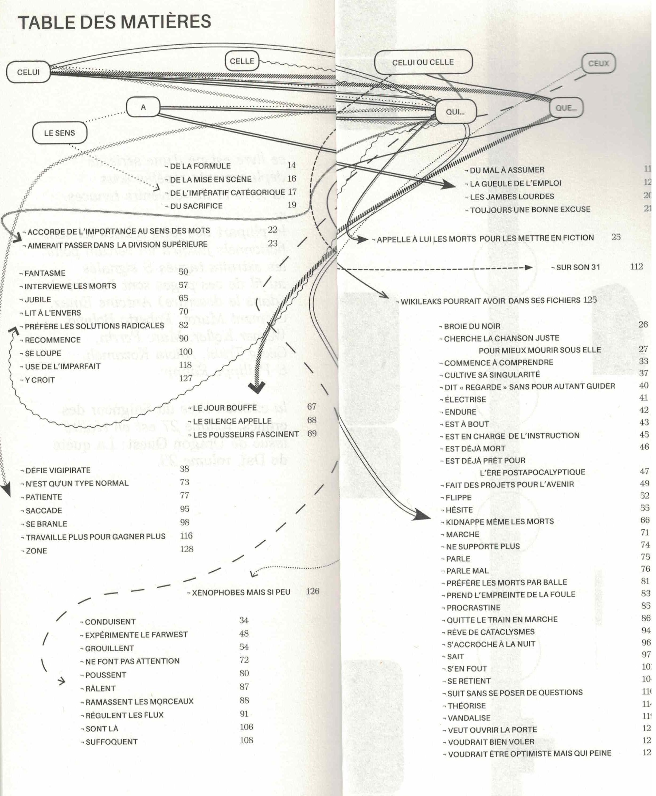<!-- .element: style="width:50%;float:left;margin-right:-1em;" -->

===

Le passage à l'imprimé nous oblige à questionner la "computabilité" qui semble ici totalement disparaître. 
Elle pose également une question un peu "piégeuse" : l'imprimé sonne-t-il la canonisation du numérique par l'effacement total de la dimension informatique ?

Je répondrais sans doute un peu à côté de cette question, en attirant l'attention sur deux éléments. 

Tout d'abord, la matérialité du livre et de l'édition qui prennent actent d'un tournant médiatique de la littérature : typographie, table des matières, format papier... l'édition n'est pas classique, et travaille la matière et le média livre. 

Le parcours hypertextuel est là aussi privilégié.

§§§§§§§§§§§§§§§§§§§§§§§§§§§§§§§§§§§§§§§§§§§§§

>La dernière strate est ici, maintenant, et prend la forme d'un livre papier. S'il fallait le définir, sans doute faudrait-il écrire ici qu'il s'agit d'un roman en pièces détachées. [...] Peut-être *Accident de personne*, durant ces quelques années d'écriture, désécriture, réécriture, a-t-il su cristalliser quelques bribes, quelques bris [des vies souterraines de nos villes]. 

Guillaume Vissac, préface d'*Accident de personne*, version imprimée, Nouvel Attila, "Othello", 2018, p.7.

<!-- .element: style="font-size:1.5rem; text-align:right" -->

===

Enfin, Vissac a produit une nouvelle préface de texte, qui vient prolonger je crois les propos de Tiphaine Samoyault, pour réfléchir à cette forme assez inédite d'auto-intertextualité et à ce parcours transmédiatique qui nous aura laissé entrevoir différents "états du texte", depuis son ancrage twittéraire à sa forme romanesque fragmentaire, lesquels viennent témoigner d'une certaine histoire littéraire numérique, mais plus largement et plus important encore, d'une histoire du Web.  

Ce changement de perspective, qui nous fait considérer un objet temporairement twittéraire non plus seulement comme un objet heuristique (ainsi que le propose Bouchardon), mais comme un objet historique, est ce qui nous permet aussi de comprendre le rôle canonique d'une oeuvre de littérature numérique.

>La dernière strate est ici, maintenant, et prend la forme d'un livre papier. S'il fallait le définir, sans doute faudrait-il écrire ici qu'il s'agit d'un roman en pièces détachées. [...] Peut-être *Accident de personne*, durant ces quelques années d'écriture, désécriture, réécriture, a-t-il su cristalliser quelques bribes, quelques bris [des vies souterraines de nos villes]. 

§§§§§§§§§§§§§§§§§§§§§§§§§§§§§§§§§§§§§§§§§§§§§

## Merci !

===

